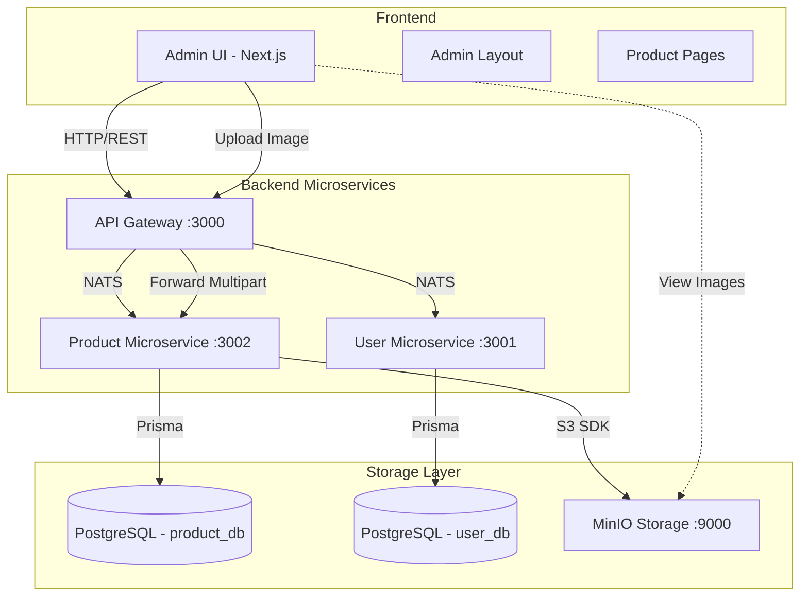
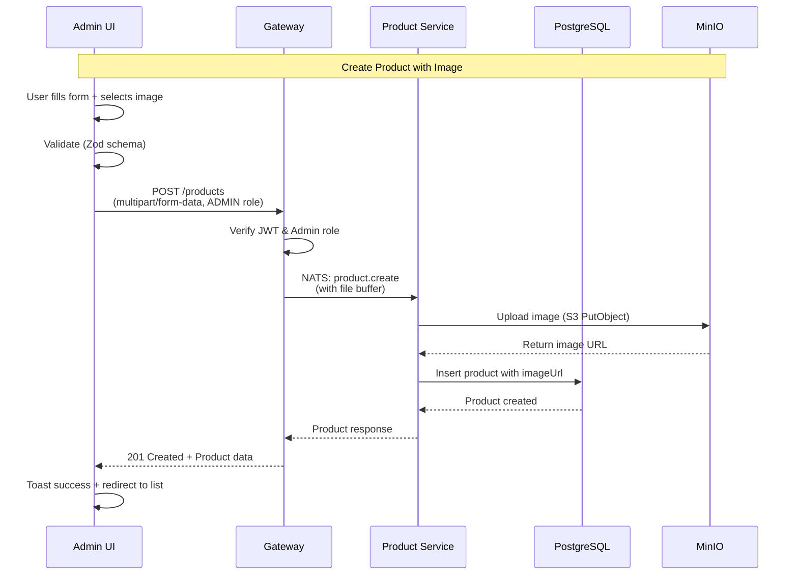

# System Design & Architecture - Admin Product Management

## Architecture Overview

**What is the high-level system structure?**



### Key Components & Responsibilities

**Frontend (Next.js 15 + TypeScript):**

- `/app/admin/layout.tsx` - Admin layout với sidebar navigation
- `/app/admin/products/page.tsx` - Product list với search/filter/pagination
- `/app/admin/products/new/page.tsx` - Create product form
- `/app/admin/products/[id]/edit/page.tsx` - Edit product form
- `features/products/services/admin-products.service.ts` - API client cho admin endpoints
- `features/products/hooks/use-admin-products.ts` - React hooks cho product management

**Backend (NestJS Microservices):**

- **Gateway** - HTTP REST endpoints, JWT verification, route guards
- **Product-app** - NATS message handlers, business logic, MinIO integration
- **User-app** - Role verification (check user has ADMIN role)

**Storage:**

- **MinIO** - S3-compatible object storage cho product images
- **PostgreSQL** - Relational data (products, categories)

### Technology Stack Choices

| Layer              | Technology              | Rationale                                                                    |
| ------------------ | ----------------------- | ---------------------------------------------------------------------------- |
| Frontend Framework | Next.js 15 (App Router) | SSR, file-based routing, React 19                                            |
| UI Components      | Shadcn UI + Radix       | Accessible, customizable, TypeScript-first                                   |
| State Management   | Zustand (auth only)     | Lightweight, no props drilling for auth                                      |
| Form Handling      | React Hook Form + Zod   | Type-safe validation, performance                                            |
| HTTP Client        | Axios                   | Interceptors for auth, better error handling                                 |
| Backend Framework  | NestJS                  | TypeScript, microservices support, NATS                                      |
| Message Broker     | NATS                    | Fast, lightweight pub/sub                                                    |
| Object Storage     | MinIO                   | S3-compatible (100% AWS S3 API), self-hosted, free, easy migration to AWS S3 |
| Database           | PostgreSQL + Prisma     | Relational data, type-safe ORM                                               |

**Note về MinIO:** MinIO được thiết kế **tương thích 100% với AWS S3 API**, cho phép sử dụng trực tiếp AWS SDK chính thức (`@aws-sdk/client-s3`). Chỉ cần cấu hình `forcePathStyle: true` vì MinIO dùng path-style URLs (`http://localhost:9000/bucket/object`) thay vì virtual-hosted style của AWS (`https://bucket.s3.amazonaws.com/object`). Điều này cho phép:

- ✅ Development local với MinIO miễn phí
- ✅ Production deploy lên AWS S3 chỉ cần đổi endpoint và remove `forcePathStyle`
- ✅ Cùng codebase chạy được trên nhiều cloud providers (AWS, GCP, Azure)
- ✅ Không bị vendor lock-in

## Data Models

**What data do we need to manage?**

### Product Entity (Extended)

```prisma
model Product {
  id            String    @id @default(cuid()) // Backend uses CUID, not UUID
  name          String
  price         Decimal   @db.Decimal(10, 2)
  description   String?   @db.Text

  // Image fields
  imageUrl      String?   // Public URL: http://localhost:9000/products/{filename}
  imageFilename String?   // Filename in MinIO for deletion

  categoryId    String?
  category      Category? @relation(fields: [categoryId], references: [id])

  // Soft delete
  isDeleted     Boolean   @default(false)

  // Audit fields
  createdAt     DateTime  @default(now())
  updatedAt     DateTime  @updatedAt

  @@index([isDeleted])
  @@index([categoryId])
  @@index([name]) // For search performance
}

model Category {
  id        String    @id @default(cuid()) // Backend uses CUID, not UUID
  name      String    @unique
  slug      String    @unique
  products  Product[]
  createdAt DateTime  @default(now())
  updatedAt DateTime  @updatedAt
}
```

### Frontend TypeScript Types

```typescript
// types/product.types.ts

export interface Product {
  id: string;
  name: string;
  price: number; // In cents (VND)
  description?: string;
  imageUrl?: string;
  imageFilename?: string;
  categoryId?: string;
  category?: Category;
  isDeleted: boolean;
  createdAt: string; // ISO date
  updatedAt: string;
}

export interface Category {
  id: string;
  name: string;
  slug: string;
}

export interface CreateProductRequest {
  name: string;
  price: number;
  description?: string;
  categoryId?: string;
  image?: File; // Multipart upload
}

export interface UpdateProductRequest {
  name?: string;
  price?: number;
  description?: string;
  categoryId?: string;
  image?: File; // Optional new image
}

export interface ProductListResponse {
  data: Product[];
  meta: {
    page: number;
    limit: number;
    total: number;
    totalPages: number;
  };
}

export interface ProductQueryParams {
  page?: number;
  limit?: number;
  search?: string;
  categoryId?: string;
}
```

### Data Flow



## API Design

**How do components communicate?**

### Frontend → Gateway (REST API)

#### 1. List Products (Admin Only - GET /products)

```http
GET /products?page=1&limit=10&search=iPhone&categoryId=clx123abc456def789
Authorization: Bearer {jwt_token}

Guards: @UseGuards(AuthGuard, RolesGuard) + @Roles(UserRole.ADMIN)
Note: Requires ADMIN role - regular users cannot access

Response: 200 OK
{
  "data": [
    {
      "id": "clx123abc456def789ghi012",
      "name": "iPhone 15 Pro",
      "price": 2500000,
      "description": "...",
      "imageUrl": "http://localhost:9000/products/abc123.jpg",
      "categoryId": "clx123abc456def789ghi012",
      "category": { "id": "clx123abc456def789ghi012", "name": "Electronics" },
      "isDeleted": false,
      "createdAt": "2025-11-04T00:00:00.000Z",
      "updatedAt": "2025-11-04T00:00:00.000Z"
    }
  ],
  "meta": {
    "page": 1,
    "limit": 10,
    "total": 45,
    "totalPages": 5
  }
}
```

#### 2. Get Single Product (Admin Only - GET /products/{id})

```http
GET /products/{id}
Authorization: Bearer {jwt_token}

Guards: @UseGuards(AuthGuard, RolesGuard) + @Roles(UserRole.ADMIN)

Response: 200 OK
{ ...product }
```

#### 3. Create Product (Admin Only - POST /products)

```http
POST /products
Authorization: Bearer {jwt_token}
Content-Type: multipart/form-data

Guards: @UseGuards(AuthGuard, RolesGuard) + @Roles(UserRole.ADMIN)

Body (form-data):
- name: "Gọng kính Rayban Classic" (text)
- price: 1999000 (text)
- description: "Gọng kính thời trang..." (text)
- categoryId: "clx123abc456def789ghi012" (CUID format)
- image: [binary file] (file)

Response: 201 Created
{ ...product with imageUrl }
```

#### 4. Update Product (Admin Only - PUT /products/{id})

```http
PUT /products/{id}
Authorization: Bearer {jwt_token}
Content-Type: multipart/form-data

Guards: @UseGuards(AuthGuard, RolesGuard) + @Roles(UserRole.ADMIN)

Body (form-data):
- name: "Updated name" (optional)
- price: 2199000 (optional)
- description: "..." (optional)
- categoryId: "clx123abc456def789ghi012" (optional, CUID format)
- image: [binary file] (optional - if provided, replace old image)

Response: 200 OK
{ ...updated product }
```

#### 5. Delete Product - Soft Delete (Admin Only - DELETE /products/{id})

```http
DELETE /products/{id}
Authorization: Bearer {jwt_token}

Guards: @UseGuards(AuthGuard, RolesGuard) + @Roles(UserRole.ADMIN)

Response: 200 OK
{ "message": "Product deleted successfully" }
```

### Gateway → Product Microservice (NATS)

```typescript
// libs/shared/events.ts
// Backend already has these events for product operations

export const EVENTS = {
  PRODUCT: {
    CREATE: "product.create",
    UPDATE: "product.update",
    DELETE: "product.delete",
    LIST: "product.list",
    GET_BY_ID: "product.getById",
    GET_BY_SLUG: "product.getBySlug",
  },
};
```

**Message Pattern Example (from existing Gateway code):**

```typescript
// Gateway Controller - /products endpoint handles both public + admin
@Controller("products")
export class ProductsController extends BaseGatewayController {
  // LIST - accessible by all users
  @Get()
  list(
    @Query() query: ProductListQueryDto,
  ): Promise<PaginatedProductsResponse> {
    return this.send(EVENTS.PRODUCT.LIST, query);
  }

  // CREATE - Admin only (role guard blocks non-admin)
  @Post()
  @UseGuards(AuthGuard, RolesGuard)
  @Roles(UserRole.ADMIN)
  create(@Body() dto: ProductCreateDto): Promise<ProductResponse> {
    return this.send(EVENTS.PRODUCT.CREATE, dto);
  }

  // UPDATE - Admin only
  @Put(":id")
  @UseGuards(AuthGuard, RolesGuard)
  @Roles(UserRole.ADMIN)
  update(
    @Param("id") id: string,
    @Body() dto: ProductUpdateDto,
  ): Promise<ProductResponse> {
    return this.send(EVENTS.PRODUCT.UPDATE, { id, dto });
  }

  // DELETE - Admin only
  @Delete(":id")
  @UseGuards(AuthGuard, RolesGuard)
  @Roles(UserRole.ADMIN)
  delete(@Param("id") id: string): Promise<SuccessResponse> {
    return this.send(EVENTS.PRODUCT.DELETE, id);
  }
}
```

### Authentication & Authorization

**Flow:**

1. User login → JWT token với payload: `{ userId, email, role }`
2. Frontend lưu token vào `auth.store` và localStorage
3. Mọi API request gửi `Authorization: Bearer {token}`
4. Gateway verify JWT và check role:
   ```typescript
   @UseGuards(AuthGuard, RolesGuard)
   @Roles(UserRole.ADMIN)  // Blocks non-admin users from POST/PUT/DELETE
   ```
5. Nếu role !== 'ADMIN' → 403 Forbidden
6. Gateway attach `userId` vào NATS message (không cần verify ở microservice)

## Component Breakdown

**What are the major building blocks?**

### Frontend Components

```
features/products/
├── components/
│   ├── admin/
│   │   ├── ProductList.tsx          # Table with search/filter
│   │   ├── ProductForm.tsx          # Reusable form (create/edit)
│   │   ├── ProductImageUpload.tsx   # Drag & drop image uploader
│   │   ├── ProductFilters.tsx       # Search + Category filter
│   │   └── DeleteProductDialog.tsx  # Confirmation dialog
│   └── ProductCard.tsx              # (user-facing, existing)
│
├── services/
│   ├── admin-products.service.ts    # API client cho admin endpoints
│   └── products.service.ts          # (user-facing, existing)
│
├── hooks/
│   ├── use-admin-products.ts        # Hook cho list + filters
│   ├── use-create-product.ts        # Hook cho create
│   ├── use-update-product.ts        # Hook cho update
│   └── use-delete-product.ts        # Hook cho delete
│
└── types/
    └── admin-product.types.ts       # Admin-specific types

app/admin/
├── layout.tsx                       # Admin sidebar layout
├── page.tsx                         # Admin dashboard (future)
└── products/
    ├── page.tsx                     # Product list page
    ├── new/
    │   └── page.tsx                 # Create product page
    └── [id]/
        └── edit/
            └── page.tsx             # Edit product page

components/layout/
└── AdminSidebar.tsx                 # Navigation for admin section
```

### Backend Services

**Gateway (apps/gateway):**

```
src/products/
├── products.controller.ts           # Admin REST endpoints
├── products.module.ts
└── guards/
    └── admin-role.guard.ts          # Check user.role === 'ADMIN'
```

**Product Microservice (apps/product-app):**

```
src/
├── products/
│   ├── products.controller.ts       # NATS @MessagePattern handlers
│   ├── products.service.ts          # Business logic
│   └── dto/
│       ├── admin-create-product.dto.ts
│       └── admin-update-product.dto.ts
│
└── minio/
    ├── minio.module.ts
    └── minio.service.ts             # upload(), delete()
```

### UI Component Design (Shadcn)

**Product List Page:**

- `<DataTable>` from Shadcn (sortable columns)
- `<Input>` với search icon (debounced)
- `<Select>` cho category filter
- `<Button>` "New Product"
- `<Badge>` cho category tags
- `<DropdownMenu>` cho row actions (Edit, Delete)

**Product Form:**

- `<Form>` (React Hook Form + Zod)
- `<Input>` cho Name, Price
- `<Textarea>` cho Description
- `<Select>` cho Category
- `<FileUpload>` (custom component với preview)
- `<Button>` Submit với loading state

## Design Decisions

**Why did we choose this approach?**

### 1. Separate Admin Layout

**Decision:** Tạo `/app/admin` với layout riêng, không reuse user layout

**Rationale:**

- Admin UI có sidebar navigation (products, categories, orders...)
- User UI có top navbar + footer
- Tránh props drilling và conditional rendering phức tạp
- Dễ apply different styles/themes cho admin

**Trade-off:** Duplicate một số components (header, theme toggle), nhưng giữ được separation of concerns

### 2. Multipart Form Data Upload

**Decision:** Dùng `multipart/form-data` thay vì JSON + base64

**Rationale:**

- Efficient cho large files (không inflate size 33% như base64)
- Backend có thể stream file trực tiếp lên MinIO
- Standard approach cho file uploads

**Trade-off:** Phức tạp hơn JSON, cần FileInterceptor ở backend

### 3. Soft Delete Instead of Hard Delete

**Decision:** Set `isDeleted: true` thay vì xóa record

**Rationale:**

- Giữ data cho audit trail
- Có thể restore nếu xóa nhầm
- Foreign key relationships không bị broken (orders still reference product)

**Trade-off:** Cần filter `isDeleted: false` ở mọi queries

### 4. Store imageFilename for Deletion

**Decision:** Lưu filename riêng ngoài imageUrl

**Rationale:**

- Parse filename từ URL không reliable (URL có thể có query params)
- Cần exact filename để gọi MinIO delete API
- Support CDN URLs sau này (URL khác storage key)

**Trade-off:** Thêm 1 column trong DB

### 5. Client-side Image Preview Before Upload

**Decision:** Preview ảnh bằng FileReader API trước khi submit

**Rationale:**

- Better UX (user thấy ảnh họ sắp upload)
- Validate dimensions/size ở client trước khi gửi
- Giảm failed uploads do invalid files

**Trade-off:** Thêm complexity ở client

### 6. MinIO với S3-Compatible API

**Decision:** Sử dụng MinIO local thay vì AWS S3 cloud, nhưng implement với AWS SDK standard

**Rationale:**

- **Development Cost:** MinIO miễn phí, self-hosted trong Docker, không tốn phí AWS
- **S3 API Compatibility:** MinIO tương thích 100% với AWS S3 API - có thể dùng AWS SDK chính thức
- **Migration Path:** Sau này deploy production lên AWS S3 chỉ cần đổi endpoint và credentials
- **Industry Standard:** Code tuân theo S3 standard, không bị lock-in vào MinIO-specific features
- **Multi-cloud Ready:** Có thể chuyển sang GCP Cloud Storage hoặc Azure Blob Storage (đều hỗ trợ S3 API)

**Implementation Details:**

```typescript
// AWS SDK configuration cho MinIO
const s3Client = new S3Client({
  endpoint: "http://localhost:9000",
  forcePathStyle: true, // ⚠️ MinIO dùng path-style URLs
  region: "us-east-1",
  credentials: {
    accessKeyId: "admin",
    secretAccessKey: "minio123456",
  },
});

// Migration sang AWS S3 chỉ cần:
// - Remove endpoint
// - Remove forcePathStyle
// - Update credentials
// → No code changes needed!
```

**Trade-off:**

- Cần hiểu path-style vs virtual-hosted style URLs
- Development team phải set `forcePathStyle: true` (lỗi phổ biến)
- Nhưng đổi lại được portable code và zero vendor lock-in

**Reference Use Cases:**

- GitHub, GitLab: Dùng MinIO cho artifact storage
- MongoDB, ClickHouse: Backup storage với MinIO
- KubeFlow, TensorFlow: AI model storage trên MinIO

## Non-Functional Requirements

**How should the system perform?**

### Performance Targets

| Metric                 | Target     | Measurement                   |
| ---------------------- | ---------- | ----------------------------- |
| Product list load time | < 2s       | 100 products, includes images |
| Search response time   | < 500ms    | Debounce 300ms + API call     |
| Image upload time      | < 5s       | 5MB JPEG file                 |
| Form submission        | < 3s       | Create/update + redirect      |
| MinIO throughput       | > 100 MB/s | Local Docker, SSD             |

### Scalability Considerations

**Current Scope (MVP):**

- Single MinIO instance (no replication)
- No CDN (direct MinIO URLs)
- No image optimization pipeline

**Future Scale:**

- MinIO distributed mode (multi-node)
- CloudFront/CloudFlare CDN cho image delivery
- Image processing worker (resize, WebP conversion, thumbnails)
- Redis cache cho product list

### Security Requirements

**Authentication:**

- JWT token với expiry (15 min access token)
- Refresh token rotation
- Token stored in httpOnly cookie (XSS protection)

**Authorization:**

- Role-based access: ADMIN role required
- Frontend route guards (`/admin/*` → check role)
- Backend endpoint guards (`@UseGuards(AdminRoleGuard)`)

**File Upload Security:**

- Whitelist MIME types: `image/jpeg`, `image/png`, `image/webp`
- Max file size: 5MB (configurable)
- Filename sanitization (hash-based names)
- No executable files accepted

**MinIO Security:**

- Public read-only bucket policy (GetObject only)
- Admin credentials in environment variables (không commit)
- No public write access (upload qua API only)

### Reliability/Availability

**Error Handling:**

- Graceful degradation: Nếu MinIO down, vẫn tạo product được (imageUrl = null)
- Retry logic: Gateway retry NATS calls 1 lần
- Timeout: 10s cho upload operations
- Rollback: Nếu DB insert fail sau upload, xóa file đã upload

**Data Persistence:**

- MinIO volume mount (persist qua container restarts)
- PostgreSQL volume mount
- Backup strategy: (future scope)

**Monitoring:**

- Log mọi file operations (upload, delete) với timestamp
- Track failed uploads (file type rejected, size exceeded)
- Alert khi MinIO không reachable

---

**Next Steps:**

1. Review design với backend team (confirm API contracts)
2. Validate MinIO setup requirements
3. Proceed to Planning phase → breakdown tasks
4. Create Figma mockups cho admin UI (optional)
