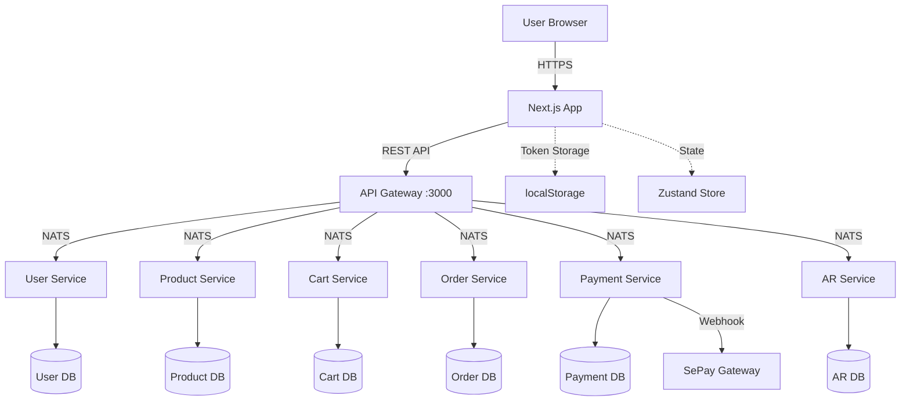
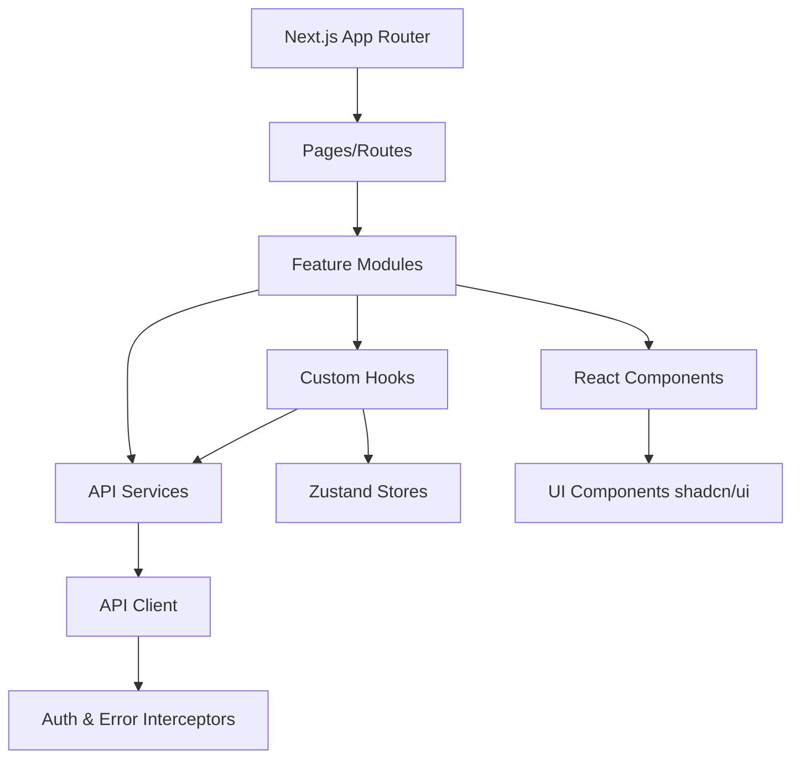
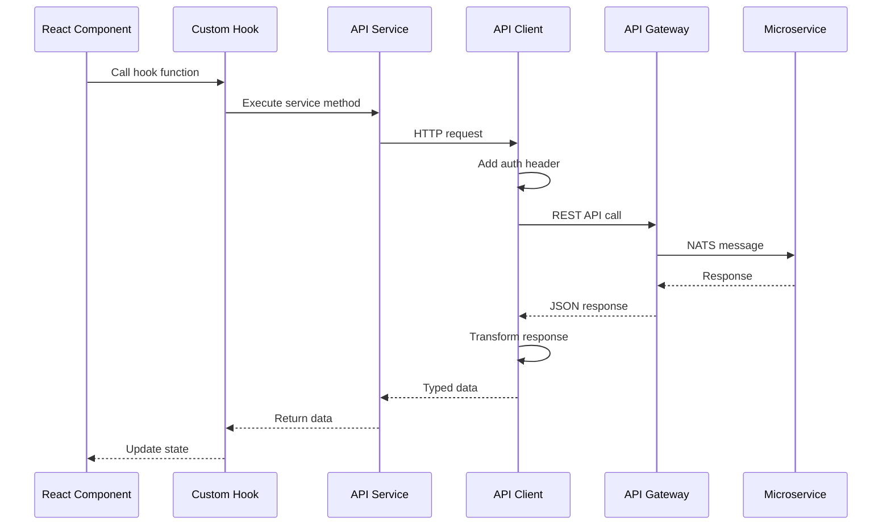
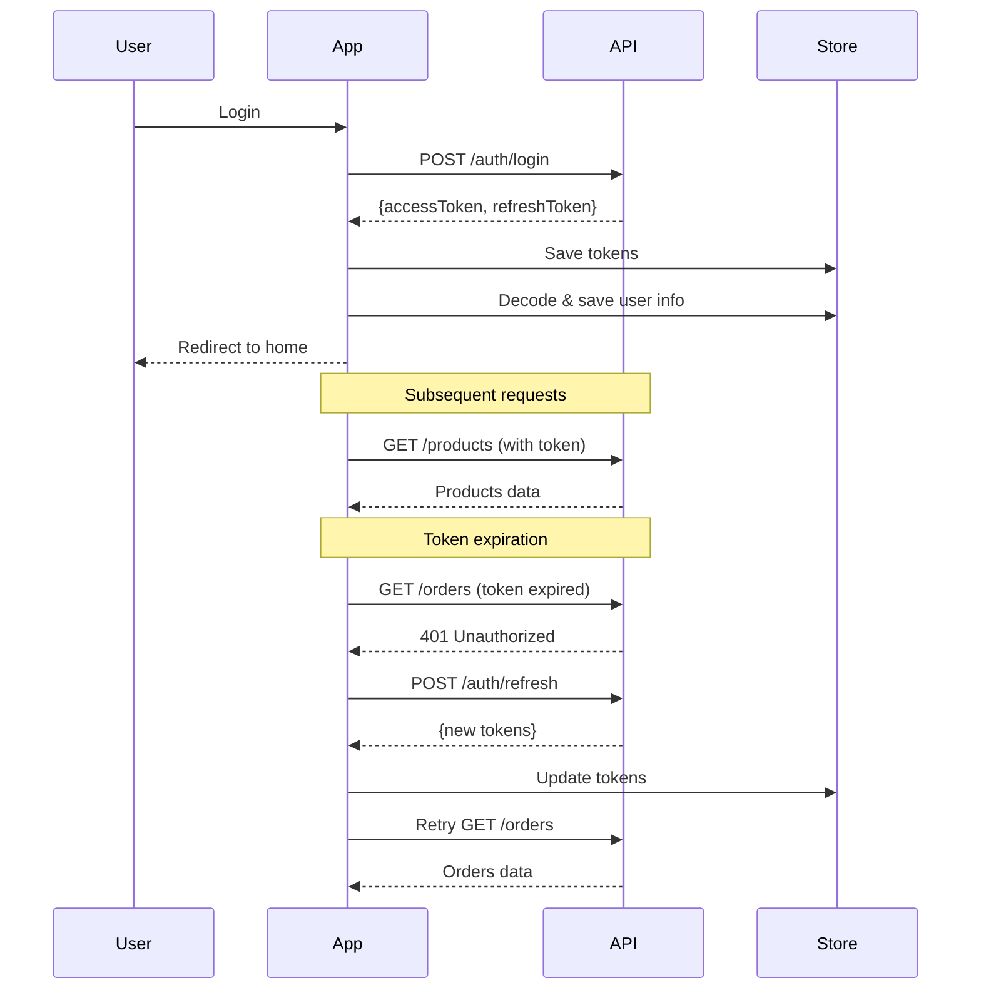

# System Design & Architecture - API Integration

## Architecture Overview

### High-Level Architecture



### Frontend Architecture



### Key Components:

1. **API Client Layer** (`lib/api-client.ts`)

   - Base HTTP client với axios
   - Request/response interceptors
   - Token management
   - Error handling

2. **Services Layer** (`services/[domain]/`)

   - Domain-specific API calls
   - Request/response transformation
   - Business logic không liên quan UI

3. **Hooks Layer** (`features/[domain]/hooks/`)

   - React hooks wrapping services
   - Loading và error states
   - Data caching và invalidation

4. **Store Layer** (`stores/`)

   - Zustand stores cho global state
   - Auth state, cart state
   - Persistence với localStorage

5. **Types Layer** (`types/[domain].types.ts`)
   - TypeScript interfaces match backend DTOs
   - Request/response types
   - Domain models

## Data Models

### Type Definition Structure

Mỗi domain có file types riêng trong `types/[domain].types.ts`:

```typescript
// types/auth.types.ts
export interface LoginRequest {
  email: string;
  password: string;
}

export interface AuthResponse {
  accessToken: string;
  refreshToken: string;
}

export interface TokenPayload {
  sub: string; // userId
  email: string;
  role: "CUSTOMER" | "ADMIN";
  iat?: number;
  exp?: number;
}
```

### Domain Models Mapping

| Domain     | Frontend Types            | Backend DTO                   | API Endpoints   |
| ---------- | ------------------------- | ----------------------------- | --------------- |
| Auth       | `types/auth.types.ts`     | `@shared/dto/auth.dto.ts`     | `/auth/*`       |
| Users      | `types/user.types.ts`     | `@shared/dto/user.dto.ts`     | `/users/*`      |
| Addresses  | `types/address.types.ts`  | `@shared/dto/address.dto.ts`  | `/addresses/*`  |
| Products   | `types/product.types.ts`  | `@shared/dto/product.dto.ts`  | `/products/*`   |
| Categories | `types/category.types.ts` | `@shared/dto/category.dto.ts` | `/categories/*` |
| Cart       | `types/cart.types.ts`     | `@shared/dto/cart.dto.ts`     | `/cart/*`       |
| Orders     | `types/order.types.ts`    | `@shared/dto/order.dto.ts`    | `/orders/*`     |
| Payments   | `types/payment.types.ts`  | `@shared/dto/payment.dto.ts`  | `/payments/*`   |
| AR         | `types/ar.types.ts`       | `@shared/dto/ar.dto.ts`       | `/ar/*`         |

### Data Flow



## API Design

### Base Configuration

```typescript
// lib/api-client.ts
const API_BASE_URL = process.env.NEXT_PUBLIC_API_URL || "http://localhost:3000";

const apiClient = axios.create({
  baseURL: API_BASE_URL,
  headers: {
    "Content-Type": "application/json",
  },
  timeout: 10000,
});
```

### Authentication Flow



### Request Interceptor

```typescript
apiClient.interceptors.request.use(
  (config) => {
    const token = getAccessToken();
    if (token) {
      config.headers.Authorization = `Bearer ${token}`;
    }
    return config;
  },
  (error) => Promise.reject(error),
);
```

### Response Interceptor

```typescript
apiClient.interceptors.response.use(
  (response) => response,
  async (error) => {
    const originalRequest = error.config;

    // Token expired - try refresh
    if (error.response?.status === 401 && !originalRequest._retry) {
      originalRequest._retry = true;

      try {
        const newToken = await refreshAccessToken();
        originalRequest.headers.Authorization = `Bearer ${newToken}`;
        return apiClient(originalRequest);
      } catch (refreshError) {
        // Refresh failed - logout
        logout();
        return Promise.reject(refreshError);
      }
    }

    return Promise.reject(error);
  },
);
```

## Component Breakdown

### 1. API Client (`lib/api-client.ts`)

**Responsibilities:**

- HTTP client configuration
- Request/response interceptors
- Token management
- Error transformation

**Dependencies:**

- axios
- Environment variables

### 2. Services Layer

#### Structure:

```
services/
├── auth/
│   ├── auth.service.ts       # Login, register, refresh, verify
│   └── index.ts
├── users/
│   ├── users.service.ts      # User CRUD, profile
│   └── index.ts
├── addresses/
│   ├── addresses.service.ts  # Address CRUD, set default
│   └── index.ts
├── products/
│   ├── products.service.ts   # Product list, CRUD
│   └── index.ts
├── categories/
│   ├── categories.service.ts # Category list, CRUD
│   └── index.ts
├── cart/
│   ├── cart.service.ts       # Cart operations
│   └── index.ts
├── orders/
│   ├── orders.service.ts     # Order CRUD, cancel
│   └── index.ts
├── payments/
│   ├── payments.service.ts   # Process, verify, COD confirm
│   └── index.ts
└── ar/
    ├── ar.service.ts         # AR snapshots
    └── index.ts
```

**Service Example:**

```typescript
// services/auth/auth.service.ts
import { apiClient } from "@/lib/api-client";
import type {
  LoginRequest,
  RegisterRequest,
  AuthResponse,
} from "@/types/auth.types";

export const authService = {
  login: async (data: LoginRequest): Promise<AuthResponse> => {
    const response = await apiClient.post("/auth/login", data);
    return response.data;
  },

  register: async (data: RegisterRequest): Promise<AuthResponse> => {
    const response = await apiClient.post("/auth/register", data);
    return response.data;
  },

  refresh: async (refreshToken: string): Promise<AuthResponse> => {
    const response = await apiClient.post("/auth/refresh", { refreshToken });
    return response.data;
  },

  getCurrentUser: async () => {
    const response = await apiClient.get("/auth/me");
    return response.data;
  },
};
```

### 3. Hooks Layer

#### Structure:

```
features/
├── auth/
│   └── hooks/
│       ├── use-auth.ts           # Login, logout, register
│       ├── use-current-user.ts   # Get current user
│       └── index.ts
├── users/
│   └── hooks/
│       ├── use-users.ts          # List, CRUD users
│       └── index.ts
├── addresses/
│   └── hooks/
│       ├── use-addresses.ts      # List, CRUD addresses
│       └── index.ts
├── products/
│   └── hooks/
│       ├── use-products.ts       # List, search products
│       ├── use-product.ts        # Single product
│       └── index.ts
├── cart/
│   └── hooks/
│       ├── use-cart.ts           # Cart operations
│       └── index.ts
├── orders/
│   └── hooks/
│       ├── use-orders.ts         # List orders
│       ├── use-order.ts          # Single order
│       └── index.ts
└── payments/
    └── hooks/
        ├── use-payment.ts        # Process payment
        └── index.ts
```

**Hook Example:**

```typescript
// features/auth/hooks/use-auth.ts
import { useState } from "react";
import { useRouter } from "next/navigation";
import { authService } from "@/services/auth";
import { useAuthStore } from "@/stores/auth.store";
import type { LoginRequest, RegisterRequest } from "@/types/auth.types";

export function useAuth() {
  const [loading, setLoading] = useState(false);
  const [error, setError] = useState<string | null>(null);
  const router = useRouter();
  const { setTokens, clearAuth } = useAuthStore();

  const login = async (data: LoginRequest) => {
    try {
      setLoading(true);
      setError(null);
      const response = await authService.login(data);
      setTokens(response.accessToken, response.refreshToken);
      router.push("/home");
    } catch (err: any) {
      setError(err.response?.data?.message || "Login failed");
      throw err;
    } finally {
      setLoading(false);
    }
  };

  const logout = () => {
    clearAuth();
    router.push("/");
  };

  return { login, logout, loading, error };
}
```

### 4. Store Layer (Zustand)

```
stores/
├── auth.store.ts      # Authentication state
├── cart.store.ts      # Cart state (existing)
├── user.store.ts      # Current user state
└── index.ts
```

**Auth Store Example:**

```typescript
// stores/auth.store.ts
import { create } from "zustand";
import { persist } from "zustand/middleware";

interface AuthState {
  accessToken: string | null;
  refreshToken: string | null;
  isAuthenticated: boolean;
  setTokens: (access: string, refresh: string) => void;
  clearAuth: () => void;
}

export const useAuthStore = create<AuthState>()(
  persist(
    (set) => ({
      accessToken: null,
      refreshToken: null,
      isAuthenticated: false,

      setTokens: (access, refresh) =>
        set({
          accessToken: access,
          refreshToken: refresh,
          isAuthenticated: true,
        }),

      clearAuth: () =>
        set({
          accessToken: null,
          refreshToken: null,
          isAuthenticated: false,
        }),
    }),
    {
      name: "auth-storage",
      partialize: (state) => ({
        refreshToken: state.refreshToken,
      }),
    },
  ),
);
```

## Design Decisions

### 1. REST vs GraphQL

**Decision**: Dùng REST API
**Rationale**:

- Backend đã implement REST
- Không cần complexity của GraphQL
- REST APIs đơn giản hơn cho team nhỏ

### 2. State Management

**Decision**: Zustand cho global state, React hooks cho local state
**Rationale**:

- Zustand nhẹ hơn Redux
- Built-in persistence
- TypeScript support tốt
- Easy to use với Next.js

### 3. Data Fetching

**Decision**: Custom hooks + axios (không dùng React Query/SWR trong phase đầu)
**Rationale**:

- Giữ dependencies tối thiểu
- Có thể migrate sang React Query sau
- Custom hooks đủ cho basic use cases

### 4. Token Storage

**Decision**:

- Access token: Memory only (trong Zustand state)
- Refresh token: localStorage (với persistence)

**Rationale**:

- Access token ngắn hạn (15m), không cần persist
- Refresh token dài hạn (7d), cần persist để auto-login
- Tránh XSS attacks

### 5. Error Handling

**Decision**: Centralized error handler trong interceptors + domain-specific errors trong hooks

**Rationale**:

- Consistent error format
- Easy to display toasts/alerts
- Can log to monitoring service

### 6. Type Generation

**Decision**: Manual type definitions (không auto-generate từ backend)

**Rationale**:

- Backend DTOs đã rõ ràng
- Manual typing giúp control được frontend types
- Có thể customize types cho UI needs

### 7. Price Format

**Decision**: Convert cents → display format trong UI components

**Rationale**:

- Backend store integer cents (199900)
- Frontend display formatted (1,999.00 VND)
- Utility function: `formatPrice(priceInt: number): string`

## Non-Functional Requirements

### Performance Targets

- **API Response Time**: < 500ms (local dev), < 1s (production)
- **Token Refresh**: Seamless, không interrupt user
- **Image Loading**: Lazy loading, optimized với Next.js Image
- **Bundle Size**: Keep services tree-shakeable

### Scalability Considerations

- **Pagination**: Support cho large datasets
- **Caching**: Response caching cho static data (categories, products)
- **Debouncing**: Search inputs debounced 300ms
- **Optimistic Updates**: Cart operations update UI immediately

### Security Requirements

- **Token Storage**: Secure storage strategy
- **HTTPS Only**: Production phải dùng HTTPS
- **Input Validation**: Client-side validation trước khi gửi API
- **XSS Protection**: Sanitize user inputs
- **CSRF Protection**: Next.js built-in protection

### Reliability/Availability

- **Error Recovery**: Auto-retry cho network errors (max 3 times)
- **Offline Support**: Graceful degradation khi offline
- **Loading States**: Skeleton screens cho better UX
- **Error Boundaries**: React error boundaries wrap critical sections

## Migration Strategy

### Phase 1: Core Infrastructure (Current)

- ✅ Setup API client
- ✅ Define types
- ✅ Create base services
- ✅ Setup auth store

### Phase 2: Authentication

- Implement auth hooks
- Update login/register pages
- Setup token refresh
- Protect routes

### Phase 3: Products & Categories

- Migrate products listing
- Migrate product detail
- Implement search/filter
- Admin CRUD (if needed)

### Phase 4: Cart Integration

- Connect cart to backend
- Sync local cart with server
- Merge guest cart on login

### Phase 5: Orders & Payments

- Implement checkout flow
- COD payment
- SePay integration
- Order tracking

### Phase 6: Additional Features

- Addresses management
- AR snapshots
- User profile
- Admin features

## Testing Strategy

### Unit Tests

- Services: Mock axios, test request/response
- Hooks: Test with React Testing Library
- Utils: Test pure functions

### Integration Tests

- Auth flow: Login → protected route
- Checkout flow: Add to cart → order → payment
- Error scenarios: Token expiration, network errors

### E2E Tests (Optional)

- Critical user journeys
- Playwright or Cypress
