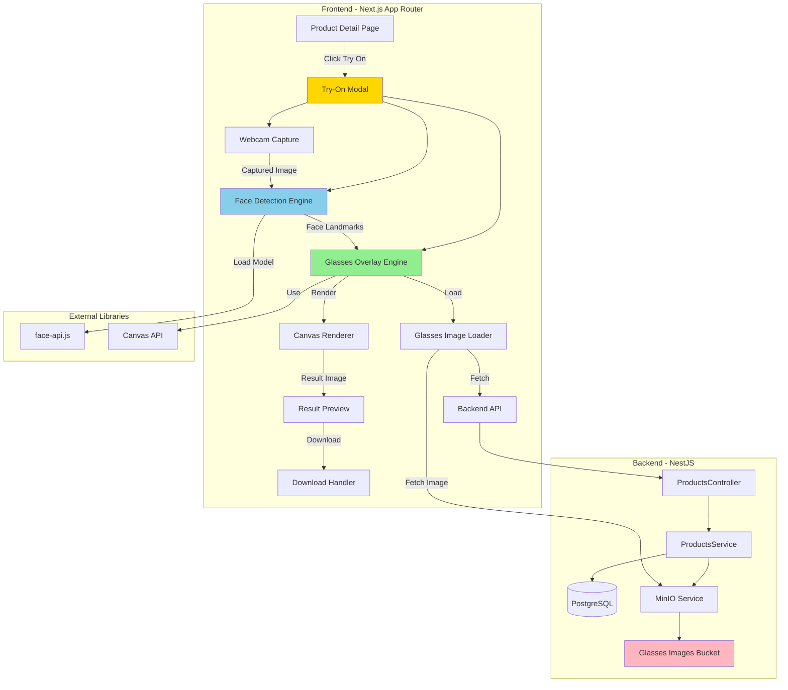

# System Design & Architecture - Glasses Try-On Simple

## Architecture Overview



### Key Components Responsibilities

1. **Frontend - Try-On Modal Component**

   - Quản lý webcam lifecycle (start/stop/permissions)
   - Capture ảnh từ webcam hoặc upload từ máy
   - Hiển thị UI cho việc chọn kính và xem kết quả
   - Xử lý download ảnh kết quả

2. **Frontend - Face Detection Engine**

   - Load face-api.js model (SSD MobileNet hoặc Tiny Face Detector)
   - Detect face landmarks từ ảnh đã chụp
   - Extract tọa độ mắt trái/phải
   - Xử lý trường hợp không detect được face

3. **Frontend - Glasses Overlay Engine**

   - Load ảnh kính (PNG) từ backend
   - Tính toán vị trí, scale, rotation dựa trên face landmarks
   - Render overlay lên canvas
   - Export ảnh kết quả

4. **Backend - Products API**
   - Serve danh sách sản phẩm có try-on assets
   - Cung cấp URL ảnh kính (PNG) từ MinIO
   - Hỗ trợ admin upload ảnh try-on PNG khi tạo/cập nhật sản phẩm (lưu lên MinIO + cập nhật `tryOnImageUrl`)
   - Không xử lý face detection (chỉ serve assets)

### Technology Stack Choices

| Component        | Technology    | Rationale                                      |
| ---------------- | ------------- | ---------------------------------------------- |
| Face Detection   | face-api.js   | Nhẹ (~2MB), dễ tích hợp, đủ chính xác cho demo |
| Image Processing | Canvas API    | Native browser API, không cần thư viện thêm    |
| Image Loading    | Next.js Image | Optimized image loading với caching            |
| State Management | React Hooks   | Đơn giản, không cần Redux cho feature này      |
| API Client       | React Query   | Caching và error handling tốt                  |

## Data Models

### Frontend Types

```typescript
// types/glasses-try-on.types.ts

// Product với try-on support
export interface ProductWithTryOn {
  id: string;
  name: string;
  priceInt: number;
  tryOnImageUrl: string; // URL ảnh PNG kính
  imageUrls: string[];
}

// Face detection result
export interface FaceLandmarks {
  leftEye: { x: number; y: number };
  rightEye: { x: number; y: number };
  nose: { x: number; y: number };
  confidence: number;
}

// Overlay configuration
export interface GlassesOverlayConfig {
  position: { x: number; y: number };
  scale: number;
  rotation: number;
  width: number;
  height: number;
}

// Try-on result
export interface TryOnResult {
  originalImage: string; // base64 hoặc blob URL
  resultImage: string; // base64 hoặc blob URL
  productId: string;
  productName: string;
  timestamp: number;
}
```

### Backend API Response

```typescript
// GET /api/products?hasTryOn=true
interface ProductsWithTryOnResponse {
  data: ProductWithTryOn[];
  total: number;
}

// Product model (backend)
interface Product {
  id: string;
  name: string;
  priceInt: number;
  tryOnImageUrl?: string; // Optional, chỉ có nếu có try-on asset
  imageUrls: string[];
  // ... other fields
}
```

## API Design

### Backend Endpoints (liên quan try-on)

#### GET /api/products (filtered by try-on trên frontend)

**Description**: Lấy danh sách sản phẩm, trong đó mỗi product có thể có `tryOnImageUrl`. Frontend tự filter các sản phẩm có hỗ trợ try-on.

**Query Parameters (ví dụ):**

- `page` (number, optional): Pagination
- `pageSize` (number, optional): Items per page

**Response (simplified):**

```json
{
  "products": [
    {
      "id": "clxxx",
      "name": "Kính Mát Ray-Ban",
      "priceInt": 1500000,
      "tryOnImageUrl": "https://minio.example.com/web-ban-kinh/try-on/glasses_01.png",
      "imageUrls": ["https://..."],
      "attributes": {
        "tryOnImageUrl": "https://minio.example.com/web-ban-kinh/try-on/glasses_01.png",
        "tryOnKey": "try-on/glasses_01.png"
      }
    }
  ],
  "total": 10,
  "page": 1,
  "pageSize": 20
}
```

**Authentication**: Không cần (public endpoint)

**CORS**: Cần cấu hình để frontend có thể fetch ảnh PNG trực tiếp từ MinIO/CDN

#### (Tương lai) Admin endpoints: Upload ảnh try-on PNG

**Note**: Sẽ được implement trong phạm vi "Admin Try-On Image Upload":

- Admin create/update product gửi kèm file PNG (chỉ `image/png`)
- Backend upload file lên MinIO (folder `try-on/`)
- Backend cập nhật `attributes.tryOnImageUrl` + `tryOnKey` cho product

### Frontend API Service

```typescript
// services/glasses-try-on.service.ts

class GlassesTryOnService extends BaseApiService {
  async getProductsWithTryOn(query?: {
    page?: number;
    pageSize?: number;
  }): Promise<ProductsWithTryOnResponse> {
    const searchParams = new URLSearchParams();
    searchParams.set("hasTryOn", "true");
    if (query?.page) searchParams.set("page", query.page.toString());
    if (query?.pageSize)
      searchParams.set("pageSize", query.pageSize.toString());

    return this.get<ProductsWithTryOnResponse>(
      `/products?${searchParams.toString()}`,
    );
  }
}
```

## Component Breakdown

### Frontend Components

#### 1. TryOnModal Component

**Location**: `features/ar/components/try-on-modal.tsx`

**Props:**

```typescript
interface TryOnModalProps {
  open: boolean;
  onOpenChange: (open: boolean) => void;
  productId?: string; // Optional: pre-select product
}
```

**Responsibilities:**

- Quản lý state: webcam, captured image, selected product, result
- Orchestrate flow: capture → detect → overlay → result
- Render UI: webcam preview, product selector, result preview

#### 2. WebcamCapture Component

**Location**: `features/ar/components/webcam-capture.tsx`

**Props:**

```typescript
interface WebcamCaptureProps {
  onCapture: (imageData: string) => void; // base64 hoặc blob URL
  onError?: (error: Error) => void;
}
```

**Responsibilities:**

- Request webcam permission
- Display video preview
- Capture frame to image
- Handle errors (permission denied, no camera)

#### 3. FaceDetector Hook

**Location**: `features/ar/hooks/use-face-detector.ts`

**API:**

```typescript
function useFaceDetector() {
  return {
    isModelLoaded: boolean;
    isLoading: boolean;
    error: Error | null;
    detectFace: (image: HTMLImageElement | HTMLCanvasElement) => Promise<FaceLandmarks | null>;
  };
}
```

**Responsibilities:**

- Load face-api.js model (lazy load, cache)
- Detect face landmarks từ ảnh
- Return tọa độ mắt trái/phải

#### 4. GlassesOverlay Hook

**Location**: `features/ar/hooks/use-glasses-overlay.ts`

**API:**

```typescript
function useGlassesOverlay() {
  return {
    overlayGlasses: (
      faceImage: HTMLImageElement,
      glassesImageUrl: string,
      landmarks: FaceLandmarks
    ) => Promise<string>; // Returns result image URL
  };
}
```

**Responsibilities:**

- Load ảnh kính từ URL
- Tính toán overlay config (position, scale, rotation)
- Render overlay lên canvas
- Export ảnh kết quả

#### 5. ProductSelector Component

**Location**: `features/ar/components/product-selector.tsx`

**Props:**

```typescript
interface ProductSelectorProps {
  products: ProductWithTryOn[];
  selectedProductId?: string;
  onSelect: (productId: string) => void;
}
```

**Responsibilities:**

- Hiển thị danh sách kính có thể thử
- Highlight selected product
- Scrollable carousel (mobile-friendly)

## Design Decisions

### Decision 1: Face Detection Library

**Chosen**: face-api.js

**Rationale:**

- Nhẹ hơn MediaPipe (~2MB vs ~10MB)
- Dễ tích hợp, không cần WebAssembly setup
- Đủ chính xác cho use case overlay kính
- Có sẵn model files, không cần tự train

**Alternatives Considered:**

- MediaPipe: Chính xác hơn nhưng nặng hơn, phức tạp hơn
- TensorFlow.js Face Detection: Tương tự face-api.js nhưng ít documentation

### Decision 2: Overlay Approach

**Chosen**: Canvas 2D API

**Rationale:**

- Native browser API, không cần thư viện thêm
- Đủ cho overlay ảnh 2D lên ảnh
- Performance tốt, dễ debug
- Có thể export ảnh kết quả dễ dàng

**Alternatives Considered:**

- WebGL: Overkill cho 2D overlay, phức tạp hơn
- SVG: Khó xử lý ảnh bitmap, performance kém hơn

### Decision 3: Image Storage Format

**Chosen**: PNG với nền trong suốt

**Rationale:**

- Hỗ trợ alpha channel (transparency)
- Dễ tạo và chỉnh sửa
- Browser support tốt
- File size hợp lý

**Alternatives Considered:**

- SVG: Có thể scale tốt nhưng phức tạp hơn, khó tạo từ ảnh thật
- WebP: Hỗ trợ transparency nhưng browser support kém hơn PNG

### Decision 4: State Management

**Chosen**: React Hooks + Local State

**Rationale:**

- Feature đơn giản, không cần global state
- State chỉ cần trong modal component
- Dễ maintain và test

**Alternatives Considered:**

- Zustand/Redux: Overkill cho feature này
- Context API: Không cần share state giữa components

## Non-Functional Requirements

### Performance Targets

- **Face Detection Model Load**: < 3 giây (first load), < 500ms (cached)
- **Face Detection on Image**: < 1 giây
- **Glasses Image Load**: < 2 giây (depends on network)
- **Overlay Rendering**: < 500ms
- **Total Time (capture → result)**: < 5 giây

### Scalability Considerations

- Face detection model được cache trong IndexedDB
- Glasses images được cache trong browser cache (via Next.js Image)
- API responses được cache bởi React Query (5 minutes stale time)

### Security Requirements

- Webcam access requires user permission (browser native)
- No sensitive data stored (images chỉ trong memory/browser)
- CORS properly configured on backend
- Input validation: image size limits, format validation

### Reliability/Availability Needs

- Graceful degradation: Nếu face detection fail → hiển thị error message
- Fallback: Nếu không có webcam → cho phép upload ảnh từ máy
- Error handling: Permission denied, model load fail, network errors

### Browser Compatibility

**Required:**

- Chrome 90+ (desktop + mobile)
- Firefox 88+ (desktop + mobile)
- Safari 14+ (desktop + iOS)

**Features Used:**

- `getUserMedia` API (webcam)
- Canvas API (overlay)
- IndexedDB (model caching)
- Fetch API (load images)
