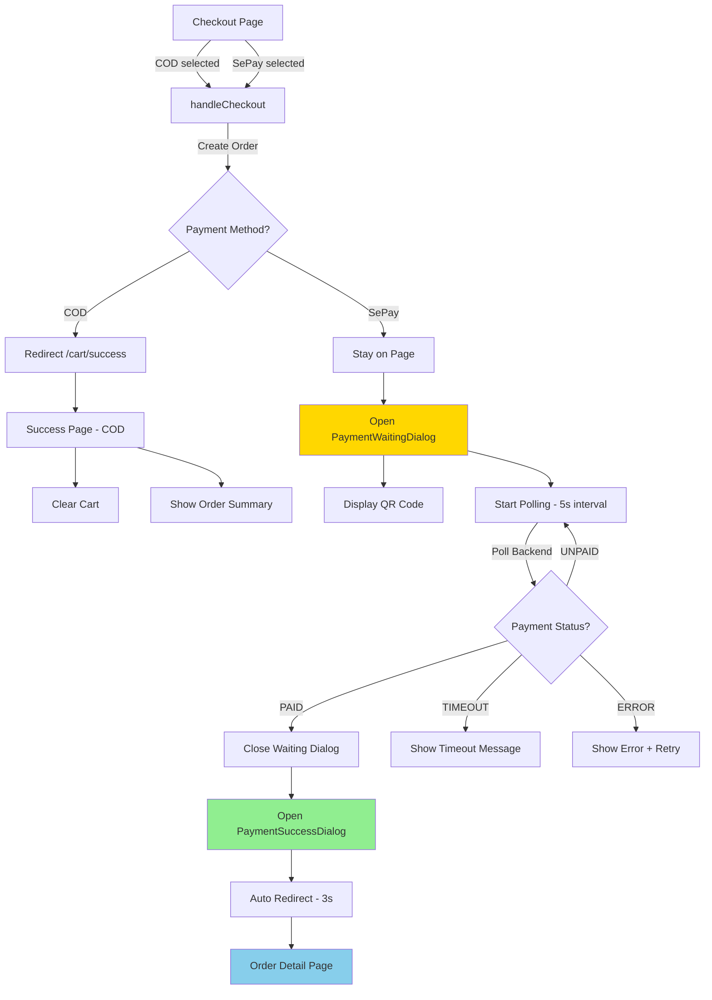
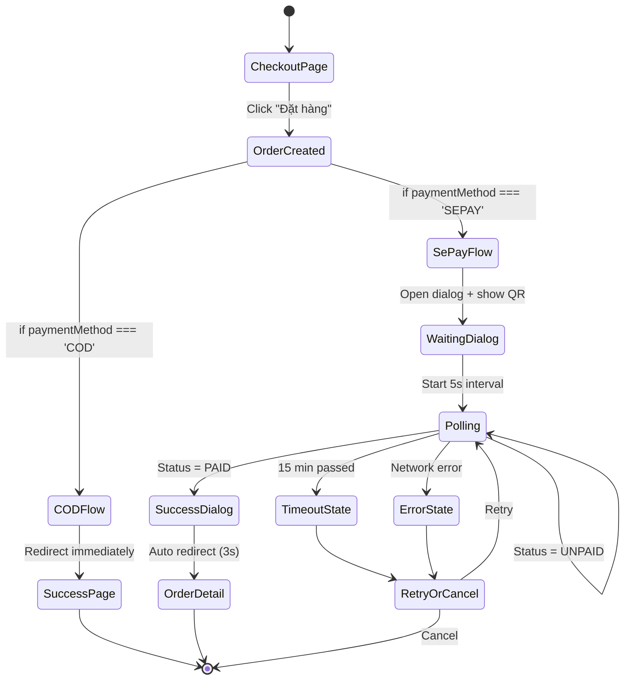
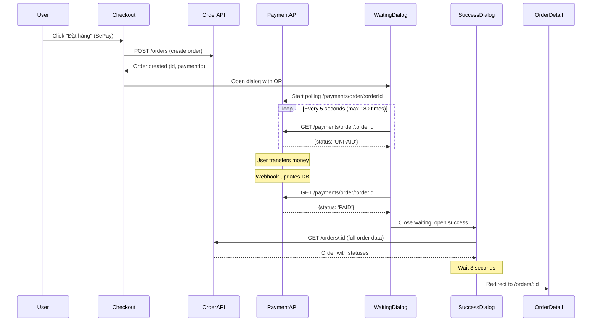

# System Design & Architecture: Payment Flow Separation

## Architecture Overview

**What is the high-level system structure?**

### Component Flow Diagram



### State Flow Diagram



### Technology Stack

#### Frontend Components:

- **Framework**: Next.js 15 (App Router)
- **UI Library**: shadcn/ui (Dialog, Badge, Button)
- **State Management**: React hooks (useState, useEffect)
- **API Client**: Axios with polling utility
- **Styling**: Tailwind CSS
- **Animations**: Framer Motion (for success dialog)

#### Backend Integration:

- **Payment API**: `/api/payments/:id/status` (polling endpoint)
- **Order API**: `/api/orders/:id` (get order details)
- **Cart API**: `/api/cart` (clear cart)
- **Webhook**: Backend → Database (already working)

## Data Models

**What data do we need to manage?**

### Core Entities

#### Order (existing, from backend)

```typescript
interface Order {
  id: string; // CUID format
  userId: string;

  // Order details
  totalAmount: number; // In cents
  shippingAddress: Address;
  items: OrderItem[];

  // Status tracking (NEW FIELDS TO DISPLAY)
  orderStatus: OrderStatus; // PENDING, PROCESSING, SHIPPED, DELIVERED, CANCELLED
  paymentStatus: PaymentStatus; // UNPAID, PAID

  // Payment info
  paymentMethod: "COD" | "SEPAY";
  paymentId: string | null;

  // Timestamps
  createdAt: Date;
  updatedAt: Date;
}

enum OrderStatus {
  PENDING = "PENDING", // Đang xử lý
  PROCESSING = "PROCESSING", // Đang xử lý
  SHIPPED = "SHIPPED", // Đang giao hàng
  DELIVERED = "DELIVERED", // Đã giao hàng
  CANCELLED = "CANCELLED", // Đã hủy
}

enum PaymentStatus {
  UNPAID = "UNPAID", // Chưa thanh toán
  PAID = "PAID", // Đã thanh toán
}
```

#### Payment (existing, from backend)

```typescript
interface Payment {
  id: string;
  orderId: string;

  // Payment details
  amount: number; // In cents
  method: "COD" | "SEPAY";
  status: PaymentStatus;

  // SePay specific
  qrCodeUrl?: string; // Generated QR URL
  accountNumber?: string; // BIDV VA
  bankName?: string; // BIDV

  // Timestamps
  createdAt: Date;
  paidAt: Date | null;
}
```

### Component State Models

#### PaymentWaitingDialog State

```typescript
interface WaitingDialogState {
  isOpen: boolean;
  orderId: string;
  paymentId: string;
  qrCodeUrl: string;

  // Polling state
  isPolling: boolean;
  pollAttempts: number;
  maxAttempts: number; // 180 (15 min @ 5s interval)

  // Status
  paymentStatus: PaymentStatus;
  error: string | null;

  // Callbacks
  onSuccess: (order: Order) => void;
  onTimeout: () => void;
  onError: (error: string) => void;
}
```

#### PaymentSuccessDialog State

```typescript
interface SuccessDialogState {
  isOpen: boolean;
  order: Order;

  // Auto redirect
  autoRedirect: boolean;
  redirectDelay: number; // 3000ms

  // Callbacks
  onViewOrder: (orderId: string) => void;
  onClose: () => void;
}
```

### Data Flow



## API Design

**How do components communicate?**

### External APIs (Backend)

#### 1. Create Order (existing)

```typescript
POST / api / orders;
Body: {
  userId: string;
  items: {
    productId: string;
    quantity: number;
  }
  [];
  shippingAddressId: string;
  paymentMethod: "COD" | "SEPAY";
}

Response: {
  id: string;
  paymentId: string;
  paymentMethod: string;
  orderStatus: OrderStatus;
  paymentStatus: PaymentStatus;
  totalAmount: number;
  // ... other fields
}
```

#### 2. Get Payment Status (polling endpoint)

```typescript
GET /api/payments/order/:orderId

Response: {
  id: string;
  orderId: string;
  status: PaymentStatus;      // "UNPAID" | "PAID"
  qrCodeUrl: string | null;
  paidAt: Date | null;
}
```

#### 3. Get Order Details (existing)

```typescript
GET /api/orders/:id

Response: {
  id: string;
  orderStatus: OrderStatus;    // ← Display this
  paymentStatus: PaymentStatus; // ← Display this
  paymentMethod: string;
  totalAmount: number;
  items: OrderItem[];
  shippingAddress: Address;
  createdAt: Date;
  updatedAt: Date;
}
```

#### 4. Clear Cart (existing)

```typescript
DELETE / api / cart;

Response: {
  success: boolean;
}
```

### Internal Interfaces (Frontend Services)

#### paymentsApi Service

```typescript
// features/payments/services/payments.service.ts
export const paymentsApi = {
  // Get payment status by order (polling)
  async getByOrder(orderId: string): Promise<Payment> {
    return apiGet<Payment>(`/payments/order/${orderId}`);
  },

  // Process payment (existing, for COD)
  async processPayment(orderId: string): Promise<Payment> {
    return apiPost<Payment>("/payments/process", { orderId });
  },
};
```

#### ordersApi Service

```typescript
// features/orders/services/orders.service.ts
export const ordersApi = {
  // Get order by ID (existing)
  async getById(orderId: string): Promise<Order> {
    return apiGet<Order>(`/orders/${orderId}`);
  },

  // Create order (existing)
  async create(data: CreateOrderRequest): Promise<Order> {
    return apiPost<Order>("/orders", data);
  },
};
```

### Authentication/Authorization

- All APIs require JWT token (handled by api-client interceptor)
- userId extracted from token (no need to pass explicitly)
- Order access validated by userId (backend checks ownership)

## Component Breakdown

**What are the major building blocks?**

### New Components to Create

#### 1. PaymentWaitingDialog

**Location**: `features/payments/components/payment-waiting-dialog.tsx`

**Purpose**: Display QR code and poll payment status for SePay orders

**Props**:

```typescript
interface PaymentWaitingDialogProps {
  open: boolean;
  onOpenChange: (open: boolean) => void;
  orderId: string;
  payment: PaymentProcessResponse; // includes paymentId, qrCode
  amountInt: number;
  onSuccess?: (order: Order) => void;
  onTimeout?: () => void;
  onError?: (error: string) => void;
}
```

**Features**:

- Display QR code image
- Show order amount and ID
- Countdown timer (15 minutes)
- Manual account info (for copy-paste)
- Polling status every 5s (by orderId)
- Loading state indicator
- Cannot be dismissed (modal)

**Dependencies**:

- shadcn Dialog
- paymentsApi.getStatus()
- use-payment-status hook (refactor existing)

---

#### 2. PaymentSuccessDialog

**Location**: `features/payments/components/payment-success-dialog.tsx`

**Purpose**: Show success message and order summary after payment confirmation

**Props**:

```typescript
interface PaymentSuccessDialogProps {
  open: boolean;
  order: Order;
  onViewOrder: (orderId: string) => void;
  autoRedirect?: boolean; // default: true
  redirectDelay?: number; // default: 3000ms
}
```

**Features**:

- Success animation (checkmark)
- Order summary (ID, amount, payment method)
- Order status badge
- Payment status badge
- "Xem chi tiết đơn hàng" button
- Auto redirect after 3s (with countdown)

**Dependencies**:

- shadcn Dialog
- Framer Motion (animations)
- OrderStatusBadge component
- PaymentStatusBadge component

---

#### 3. OrderStatusBadge

**Location**: `features/orders/components/order-status-badge.tsx`

**Purpose**: Display order status with color-coded badge

**Props**:

```typescript
interface OrderStatusBadgeProps {
  status: OrderStatus;
  className?: string;
}
```

**Status Mapping**:

```typescript
const statusConfig = {
  PENDING: { label: "Chờ xử lý", color: "yellow" },
  PROCESSING: { label: "Đang xử lý", color: "yellow" },
  SHIPPED: { label: "Đang giao hàng", color: "purple" },
  DELIVERED: { label: "Đã giao hàng", color: "green" },
  CANCELLED: { label: "Đã hủy", color: "red" },
};
```

**Dependencies**:

- shadcn Badge

---

#### 4. PaymentStatusBadge

**Location**: `features/payments/components/payment-status-badge.tsx`

**Purpose**: Display payment status with color-coded badge

**Props**:

```typescript
interface PaymentStatusBadgeProps {
  status: PaymentStatus;
  className?: string;
}
```

**Status Mapping**:

```typescript
const statusConfig = {
  UNPAID: { label: "Chưa thanh toán", color: "yellow" },
  PAID: { label: "Đã thanh toán", color: "green" },
};
```

**Dependencies**:

- shadcn Badge

---

### Components to Modify

#### 5. CheckoutContent (existing)

**Location**: `features/checkout/components/checkout-content.tsx`

**Changes**:

- Add state for dialog visibility
- Split `handleCheckout` logic:

  ```typescript
  const handleCheckout = async () => {
    const order = await ordersApi.create(data);
    if (selectedPayment === "COD") {
      router.push(`/cart/success?orderId=${order.id}&paymentMethod=COD`);
    } else if (selectedPayment === "SEPAY") {
      const payment = await paymentsApi.process(order.id, "SEPAY", totalInt);
      setWaitingDialogOpen(true);
      setCreatedOrderId(order.id);
      setPaymentId(payment.paymentId);
      setQrCodeUrl(payment.qrCode || "");
    }
  };
  ```

**New State**:

```typescript
const [waitingDialogOpen, setWaitingDialogOpen] = useState(false);
const [successDialogOpen, setSuccessDialogOpen] = useState(false);
const [completedOrder, setCompletedOrder] = useState<Order | null>(null);
```

---

#### 6. SuccessPage (existing)

**Location**: `app/(shop)/cart/success/page.tsx`

**Changes**:

- Make page COD-specific (no SePay logic)
- Remove auto payment processing for SePay
- Keep simple success message for COD
- Remove SepayQRDisplay (moved to dialog)

**Logic**:

```typescript
const paymentMethod = searchParams.get("paymentMethod");

if (paymentMethod === "SEPAY") {
  // SePay should never reach this page
  redirect("/orders"); // Or show error
}

// COD flow only
useEffect(() => {
  // Fetch order
  // Clear cart
  // Show success message
}, []);
```

---

### Shared Hooks

#### use-payment-polling.ts (NEW)

**Location**: `features/payments/hooks/use-payment-polling.ts`

**Purpose**: Reusable polling logic for payment status

```typescript
export function usePaymentPolling(
  paymentId: string,
  options?: {
    interval?: number;
    maxAttempts?: number;
    onSuccess?: (payment: Payment) => void;
    onTimeout?: () => void;
    onError?: (error: string) => void;
  },
) {
  const [status, setStatus] = useState<PaymentStatus>(PaymentStatus.UNPAID);
  const [isPolling, setIsPolling] = useState(false);
  const [attempts, setAttempts] = useState(0);
  const [error, setError] = useState<string | null>(null);

  // Polling logic with useEffect + setInterval
  // Stop when: status === PaymentStatus.PAID | attempts >= maxAttempts | error

  return { status, isPolling, attempts, error };
}
```

## Design Decisions

**Why did we choose this approach?**

### Decision 1: Dialog vs Full Page for SePay Waiting

**Chosen**: Dialog (modal)

**Rationale**:

- ✅ Keeps user in context (no navigation away)
- ✅ Can't accidentally navigate away during payment
- ✅ QR code is immediately visible (no scroll needed)
- ✅ Better mobile UX (full screen on small devices)
- ✅ Prevents back button confusion

**Alternatives Considered**:

- ❌ Separate waiting page: Requires navigation, can lose context
- ❌ Toast notification: Too small for QR code
- ❌ Inline on checkout page: Clutters checkout UI

---

### Decision 2: Auto Redirect vs Manual Button

**Chosen**: Auto redirect with countdown + manual button (both)

**Rationale**:

- ✅ Power users get fast experience (auto 3s)
- ✅ Careful users can click button (immediate control)
- ✅ Countdown provides feedback
- ✅ Can cancel auto redirect if needed

**Alternatives Considered**:

- ❌ Auto redirect only: No user control
- ❌ Manual button only: Slow for power users

---

### Decision 3: Polling Interval (5 seconds)

**Chosen**: 5s interval, 180 max attempts (15 minutes)

**Rationale**:

- ✅ Avoids 429 rate limiting (tested)
- ✅ Bank transfers take 1-5 minutes typically
- ✅ 15 min buffer for slow banks
- ✅ Balance between UX and server load

**Alternatives Considered**:

- ❌ 3s interval: Caused 429 errors
- ❌ 10s interval: Too slow, bad UX
- ❌ WebSocket: Overkill, adds complexity

---

### Decision 4: Status Badge Colors

**Chosen**: Semantic color mapping (yellow=pending, green=success, red=error)

**Rationale**:

- ✅ Industry standard (Bootstrap, Tailwind conventions)
- ✅ Accessible (color + text label)
- ✅ Intuitive for Vietnamese users
- ✅ Matches existing shadcn Badge variants

---

### Decision 5: Redirect to Order Detail (not Success Page)

**Chosen**: `/orders/:id` for SePay, `/cart/success` for COD

**Rationale**:

- ✅ SePay users already saw success dialog (no need for success page)
- ✅ Order detail provides more value (tracking, invoice, etc.)
- ✅ COD users expect traditional success page flow
- ✅ Reduces redundant pages

## Non-Functional Requirements

**How should the system perform?**

### Performance Targets

- **Dialog Rendering**: < 500ms (initial open)
- **QR Code Load**: < 1s (image load)
- **Polling Request**: < 200ms (average response time)
- **Success Dialog Animation**: 60 FPS (smooth)
- **Order Detail Redirect**: < 2s (page load)

### Scalability Considerations

- Polling is client-side (no server load increase)
- Backend webhook handles payment async (already working)
- Frontend can handle 100+ concurrent polling users
- No database writes from polling (read-only)

### Security Requirements

- ✅ JWT token required for all APIs
- ✅ userId validation on backend (order ownership)
- ✅ Payment status can only be updated by webhook (not client)
- ✅ QR code URLs are temporary (expire after 15 min)
- ✅ No sensitive data in localStorage (only orderId)
- ✅ HTTPS required for all API calls

### Reliability/Availability

- **Polling Retry**: 3 automatic retries on network error
- **Fallback UI**: Show error message + manual retry button
- **Offline Handling**: Detect offline, pause polling, resume when online
- **State Persistence**: Save polling state to localStorage (survive refresh)
- **Graceful Degradation**: If polling fails, show manual check instructions

### Accessibility (A11y)

- ✅ Dialog keyboard navigation (Escape to close success dialog)
- ✅ Focus trap in waiting dialog (prevent escape during payment)
- ✅ Screen reader announcements for status changes
- ✅ Color + text labels for status badges (not color-only)
- ✅ Loading states with aria-live regions

---

**Status**: ✅ Design Complete
**Next Phase**: Planning → Task Breakdown & Timeline
