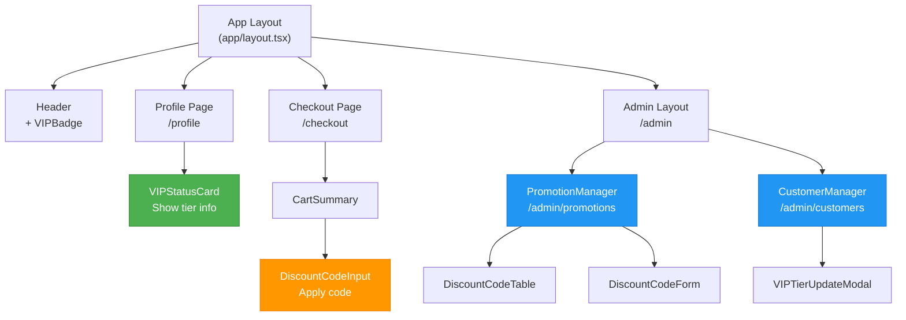

# System Design & Architecture - Frontend

## Architecture Overview

### Component Hierarchy



### Technology Stack

| Layer                | Technology                  | Purpose                            |
| -------------------- | --------------------------- | ---------------------------------- |
| **Framework**        | Next.js 14 App Router       | React framework with SSR           |
| **Language**         | TypeScript                  | Type-safe development              |
| **UI Components**    | shadcn/ui                   | Pre-built accessible components    |
| **Forms**            | react-hook-form + zod       | Form validation and management     |
| **State Management** | React Query (TanStack)      | Server state, caching              |
| **Styling**          | Tailwind CSS                | Utility-first CSS                  |
| **Icons**            | lucide-react                | Icon library                       |
| **Notifications**    | sonner                      | Toast notifications                |

## Data Models (Frontend Types)

### Shared Types

**File**: `types/promotion.types.ts`

```typescript
import { z } from 'zod'

// Enums
export enum VipTier {
  STANDARD = 'STANDARD',
  BRONZE = 'BRONZE',
  SILVER = 'SILVER',
  GOLD = 'GOLD',
  PLATINUM = 'PLATINUM',
}

export enum DiscountType {
  PERCENTAGE = 'PERCENTAGE',
  FIXED_AMOUNT = 'FIXED_AMOUNT',
}

// VIP Info Response
export const VipInfoSchema = z.object({
  userId: z.string(),
  currentTier: z.nativeEnum(VipTier),
  totalSpentInt: z.number().int(),
  discountRate: z.number(), // 0.05 = 5%
  nextTier: z.object({
    tier: z.nativeEnum(VipTier),
    requiredSpending: z.number().int(),
    remaining: z.number().int(),
  }).nullable(),
})

export type VipInfo = z.infer<typeof VipInfoSchema>

// Discount Code
export const DiscountCodeSchema = z.object({
  id: z.string(),
  code: z.string(),
  description: z.string().nullable(),
  type: z.nativeEnum(DiscountType),
  value: z.number().int(),
  requiredTier: z.nativeEnum(VipTier).nullable(),
  maxUsages: z.number().int().nullable(),
  usedCount: z.number().int(),
  maxUsagePerUser: z.number().int().nullable(),
  startsAt: z.string().datetime().nullable(),
  expiresAt: z.string().datetime().nullable(),
  isActive: z.boolean(),
  minPurchaseInt: z.number().int().nullable(),
  createdAt: z.string().datetime(),
  updatedAt: z.string().datetime(),
})

export type DiscountCode = z.infer<typeof DiscountCodeSchema>

// Discount Validation Response
export const DiscountValidationSchema = z.object({
  valid: z.boolean(),
  discountCode: DiscountCodeSchema.nullable(),
  discountedInt: z.number().int().nullable(),
  finalTotalInt: z.number().int().nullable(),
  error: z.enum([
    'CODE_EXPIRED',
    'TIER_NOT_MET',
    'MAX_USAGE_REACHED',
    'MIN_PURCHASE_NOT_MET',
    'CODE_NOT_FOUND',
    'CODE_INACTIVE',
  ]).nullable(),
})

export type DiscountValidation = z.infer<typeof DiscountValidationSchema>

// Create Discount Code DTO
export const CreateDiscountCodeSchema = z.object({
  code: z.string().min(3).max(20).regex(/^[A-Z0-9]+$/),
  description: z.string().optional(),
  type: z.nativeEnum(DiscountType),
  value: z.number().int().positive(),
  requiredTier: z.nativeEnum(VipTier).nullable(),
  maxUsages: z.number().int().positive().nullable(),
  maxUsagePerUser: z.number().int().positive().nullable(),
  startsAt: z.string().datetime().nullable(),
  expiresAt: z.string().datetime().nullable(),
  minPurchaseInt: z.number().int().positive().nullable(),
})

export type CreateDiscountCodeDto = z.infer<typeof CreateDiscountCodeSchema>

// Update VIP Tier DTO
export const UpdateVipTierSchema = z.object({
  newTier: z.nativeEnum(VipTier),
  reason: z.string().min(10, 'Reason must be at least 10 characters'),
})

export type UpdateVipTierDto = z.infer<typeof UpdateVipTierSchema>
```

## API Integration

### API Service Layer

**File**: `services/promotions.service.ts`

```typescript
import { BaseApiService } from '@/lib/api-client'
import type { 
  VipInfo, 
  DiscountCode, 
  DiscountValidation,
  CreateDiscountCodeDto,
  UpdateVipTierDto,
} from '@/types/promotion.types'

class PromotionsApiService extends BaseApiService {
  // Customer: Get my VIP info
  async getMyVipInfo(): Promise<VipInfo> {
    const response = await this.get<VipInfo>('/users/me/vip')
    return VipInfoSchema.parse(response)
  }
  
  // Customer: Validate discount code
  async validateDiscountCode(
    code: string,
    subtotalInt: number,
  ): Promise<DiscountValidation> {
    const response = await this.post<DiscountValidation>('/promotions/codes/validate', {
      code: code.toUpperCase(),
      subtotalInt,
    })
    return DiscountValidationSchema.parse(response)
  }
  
  // Customer: Apply discount code to order
  async applyDiscountCode(
    code: string,
    orderId: string,
    subtotalInt: number,
  ): Promise<{ success: boolean; discountedInt: number }> {
    return this.post('/promotions/codes/apply', {
      code: code.toUpperCase(),
      orderId,
      subtotalInt,
    })
  }
  
  // Admin: List discount codes
  async listDiscountCodes(params?: {
    page?: number
    limit?: number
    tier?: VipTier | null
    status?: 'active' | 'inactive' | 'all'
    search?: string
  }): Promise<PaginatedResponse<DiscountCode>> {
    const searchParams = new URLSearchParams()
    if (params?.page) searchParams.set('page', params.page.toString())
    if (params?.limit) searchParams.set('limit', params.limit.toString())
    if (params?.tier) searchParams.set('tier', params.tier)
    if (params?.status) searchParams.set('status', params.status)
    if (params?.search) searchParams.set('search', params.search)
    
    const response = await this.get<PaginatedResponse<DiscountCode>>(
      `/promotions/codes?${searchParams}`
    )
    return response
  }
  
  // Admin: Create discount code
  async createDiscountCode(dto: CreateDiscountCodeDto): Promise<DiscountCode> {
    const response = await this.post<DiscountCode>('/promotions/codes', dto)
    return DiscountCodeSchema.parse(response)
  }
  
  // Admin: Update discount code
  async updateDiscountCode(
    id: string,
    updates: Partial<CreateDiscountCodeDto> & { isActive?: boolean }
  ): Promise<DiscountCode> {
    const response = await this.patch<DiscountCode>(`/promotions/codes/${id}`, updates)
    return DiscountCodeSchema.parse(response)
  }
  
  // Admin: Delete discount code
  async deleteDiscountCode(id: string): Promise<void> {
    await this.delete(`/promotions/codes/${id}`)
  }
  
  // Admin: Update user VIP tier
  async updateUserVipTier(
    userId: string,
    dto: UpdateVipTierDto,
  ): Promise<User> {
    return this.patch(`/users/${userId}/vip-tier`, dto)
  }
}

export const promotionsApi = new PromotionsApiService()
```

### React Query Hooks

**File**: `features/promotions/hooks/use-promotions.ts`

```typescript
import { useQuery, useMutation, useQueryClient } from '@tanstack/react-query'
import { promotionsApi } from '@/services/promotions.service'
import { toast } from 'sonner'

// Query Keys
export const promotionKeys = {
  all: ['promotions'] as const,
  vipInfo: () => [...promotionKeys.all, 'vip-info'] as const,
  codes: () => [...promotionKeys.all, 'codes'] as const,
  codesList: (params: ListCodesParams) => [...promotionKeys.codes(), params] as const,
}

// Hook: Get my VIP info
export function useMyVipInfo() {
  return useQuery({
    queryKey: promotionKeys.vipInfo(),
    queryFn: () => promotionsApi.getMyVipInfo(),
    staleTime: 5 * 60 * 1000, // 5 minutes
  })
}

// Hook: Validate discount code
export function useValidateDiscountCode() {
  return useMutation({
    mutationFn: ({ code, subtotalInt }: { code: string; subtotalInt: number }) =>
      promotionsApi.validateDiscountCode(code, subtotalInt),
  })
}

// Hook: List discount codes (Admin)
export function useDiscountCodes(params?: ListCodesParams) {
  return useQuery({
    queryKey: promotionKeys.codesList(params || {}),
    queryFn: () => promotionsApi.listDiscountCodes(params),
    staleTime: 2 * 60 * 1000, // 2 minutes
  })
}

// Hook: Create discount code (Admin)
export function useCreateDiscountCode() {
  const queryClient = useQueryClient()
  
  return useMutation({
    mutationFn: (dto: CreateDiscountCodeDto) => 
      promotionsApi.createDiscountCode(dto),
    onSuccess: () => {
      queryClient.invalidateQueries({ queryKey: promotionKeys.codes() })
      toast.success('Discount code created successfully')
    },
    onError: (error) => {
      toast.error(`Failed to create discount code: ${error.message}`)
    },
  })
}

// Hook: Update discount code (Admin)
export function useUpdateDiscountCode() {
  const queryClient = useQueryClient()
  
  return useMutation({
    mutationFn: ({ id, updates }: { id: string; updates: Partial<DiscountCode> }) =>
      promotionsApi.updateDiscountCode(id, updates),
    onSuccess: () => {
      queryClient.invalidateQueries({ queryKey: promotionKeys.codes() })
      toast.success('Discount code updated successfully')
    },
  })
}

// Hook: Delete discount code (Admin)
export function useDeleteDiscountCode() {
  const queryClient = useQueryClient()
  
  return useMutation({
    mutationFn: (id: string) => promotionsApi.deleteDiscountCode(id),
    onSuccess: () => {
      queryClient.invalidateQueries({ queryKey: promotionKeys.codes() })
      toast.success('Discount code deleted successfully')
    },
  })
}

// Hook: Update user VIP tier (Admin)
export function useUpdateVipTier() {
  const queryClient = useQueryClient()
  
  return useMutation({
    mutationFn: ({ userId, dto }: { userId: string; dto: UpdateVipTierDto }) =>
      promotionsApi.updateUserVipTier(userId, dto),
    onSuccess: () => {
      queryClient.invalidateQueries({ queryKey: ['users'] })
      toast.success('VIP tier updated successfully')
    },
  })
}
```

## Component Design

### 1. VIPBadge Component

**File**: `components/promotions/vip-badge.tsx`

```tsx
import { Badge } from '@/components/ui/badge'
import { cn } from '@/lib/utils'
import { VipTier } from '@/types/promotion.types'

interface VIPBadgeProps {
  tier: VipTier
  className?: string
  showLabel?: boolean
}

const tierConfig = {
  [VipTier.STANDARD]: { icon: '', label: '', color: '' },
  [VipTier.BRONZE]: { icon: '🥉', label: 'Bronze', color: 'bg-amber-700 text-white' },
  [VipTier.SILVER]: { icon: '🥈', label: 'Silver', color: 'bg-gray-400 text-black' },
  [VipTier.GOLD]: { icon: '🥇', label: 'Gold', color: 'bg-yellow-400 text-black' },
  [VipTier.PLATINUM]: { icon: '💎', label: 'Platinum', color: 'bg-purple-500 text-white' },
}

export function VIPBadge({ tier, className, showLabel = true }: VIPBadgeProps) {
  if (tier === VipTier.STANDARD) return null
  
  const config = tierConfig[tier]
  
  return (
    <Badge className={cn(config.color, className)}>
      <span className="mr-1">{config.icon}</span>
      {showLabel && config.label}
    </Badge>
  )
}
```

### 2. VIPStatusCard Component

**File**: `features/promotions/components/vip-status-card.tsx`

```tsx
import { Card, CardHeader, CardTitle, CardContent } from '@/components/ui/card'
import { VIPBadge } from '@/components/promotions/vip-badge'
import { useMyVipInfo } from '../hooks/use-promotions'
import { formatVND } from '@/lib/utils'
import { Skeleton } from '@/components/ui/skeleton'

export function VIPStatusCard() {
  const { data: vipInfo, isLoading } = useMyVipInfo()
  
  if (isLoading) {
    return <Card><CardContent><Skeleton className="h-32" /></CardContent></Card>
  }
  
  if (!vipInfo) return null
  
  return (
    <Card>
      <CardHeader>
        <CardTitle className="flex items-center gap-2">
          VIP Status
          <VIPBadge tier={vipInfo.currentTier} />
        </CardTitle>
      </CardHeader>
      <CardContent className="space-y-4">
        <div>
          <p className="text-sm text-muted-foreground">Total Spending</p>
          <p className="text-2xl font-bold">{formatVND(vipInfo.totalSpentInt)}</p>
        </div>
        
        <div>
          <p className="text-sm text-muted-foreground">Your Discount Rate</p>
          <p className="text-xl font-semibold">{vipInfo.discountRate * 100}%</p>
        </div>
        
        {vipInfo.nextTier && (
          <div>
            <p className="text-sm text-muted-foreground">
              Next Tier: <VIPBadge tier={vipInfo.nextTier.tier} />
            </p>
            <p className="text-sm">
              Spend {formatVND(vipInfo.nextTier.remaining)} more to unlock
            </p>
          </div>
        )}
      </CardContent>
    </Card>
  )
}
```

### 3. DiscountCodeInput Component

**File**: `features/promotions/components/discount-code-input.tsx`

```tsx
'use client'

import { useState } from 'react'
import { Button } from '@/components/ui/button'
import { Input } from '@/components/ui/input'
import { useValidateDiscountCode } from '../hooks/use-promotions'
import { Loader2 } from 'lucide-react'
import { toast } from 'sonner'

interface DiscountCodeInputProps {
  subtotalInt: number
  onApplied: (code: string, discountedInt: number) => void
  appliedCode?: string | null
  onRemove: () => void
}

export function DiscountCodeInput({
  subtotalInt,
  onApplied,
  appliedCode,
  onRemove,
}: DiscountCodeInputProps) {
  const [code, setCode] = useState('')
  const validateMutation = useValidateDiscountCode()
  
  const handleApply = async () => {
    if (!code.trim()) {
      toast.error('Please enter a discount code')
      return
    }
    
    const result = await validateMutation.mutateAsync({ 
      code: code.toUpperCase(), 
      subtotalInt 
    })
    
    if (result.valid && result.discountedInt) {
      onApplied(code.toUpperCase(), result.discountedInt)
      toast.success(`Discount applied: ${formatVND(result.discountedInt)} off`)
    } else {
      const errorMessages = {
        CODE_EXPIRED: 'This code has expired',
        TIER_NOT_MET: 'Your VIP tier is not eligible for this code',
        MAX_USAGE_REACHED: 'This code has reached its usage limit',
        MIN_PURCHASE_NOT_MET: 'Minimum purchase amount not met',
        CODE_NOT_FOUND: 'Invalid discount code',
        CODE_INACTIVE: 'This code is not active',
      }
      toast.error(errorMessages[result.error] || 'Invalid discount code')
    }
  }
  
  if (appliedCode) {
    return (
      <div className="flex items-center gap-2 p-3 bg-green-50 rounded-md">
        <p className="text-sm flex-1">
          <span className="font-semibold">{appliedCode}</span> applied
        </p>
        <Button variant="ghost" size="sm" onClick={onRemove}>
          Remove
        </Button>
      </div>
    )
  }
  
  return (
    <div className="flex gap-2">
      <Input
        placeholder="Enter discount code"
        value={code}
        onChange={(e) => setCode(e.target.value.toUpperCase())}
        disabled={validateMutation.isPending}
      />
      <Button 
        onClick={handleApply}
        disabled={validateMutation.isPending || !code.trim()}
      >
        {validateMutation.isPending && <Loader2 className="mr-2 h-4 w-4 animate-spin" />}
        Apply
      </Button>
    </div>
  )
}
```

### 4. Admin: DiscountCodeTable Component

**File**: `features/promotions/components/discount-code-table.tsx`

```tsx
'use client'

import { useState } from 'react'
import { useDiscountCodes, useUpdateDiscountCode, useDeleteDiscountCode } from '../hooks/use-promotions'
import {
  Table,
  TableBody,
  TableCell,
  TableHead,
  TableHeader,
  TableRow,
} from '@/components/ui/table'
import { Button } from '@/components/ui/button'
import { Badge } from '@/components/ui/badge'
import { Switch } from '@/components/ui/switch'
import { Pencil, Trash2 } from 'lucide-react'
import { DiscountCodeFormDialog } from './discount-code-form-dialog'
import type { DiscountCode } from '@/types/promotion.types'

export function DiscountCodeTable() {
  const [editingCode, setEditingCode] = useState<DiscountCode | null>(null)
  const { data, isLoading } = useDiscountCodes()
  const updateMutation = useUpdateDiscountCode()
  const deleteMutation = useDeleteDiscountCode()
  
  const handleToggleActive = (code: DiscountCode) => {
    updateMutation.mutate({
      id: code.id,
      updates: { isActive: !code.isActive },
    })
  }
  
  const handleDelete = (id: string) => {
    if (confirm('Are you sure you want to delete this discount code?')) {
      deleteMutation.mutate(id)
    }
  }
  
  if (isLoading) return <div>Loading...</div>
  
  return (
    <>
      <Table>
        <TableHeader>
          <TableRow>
            <TableHead>Code</TableHead>
            <TableHead>Type</TableHead>
            <TableHead>Value</TableHead>
            <TableHead>Tier</TableHead>
            <TableHead>Usage</TableHead>
            <TableHead>Expiry</TableHead>
            <TableHead>Active</TableHead>
            <TableHead>Actions</TableHead>
          </TableRow>
        </TableHeader>
        <TableBody>
          {data?.data.map((code) => (
            <TableRow key={code.id}>
              <TableCell className="font-mono">{code.code}</TableCell>
              <TableCell>
                <Badge>{code.type}</Badge>
              </TableCell>
              <TableCell>
                {code.type === 'PERCENTAGE' ? `${code.value}%` : formatVND(code.value)}
              </TableCell>
              <TableCell>
                {code.requiredTier ? <VIPBadge tier={code.requiredTier} /> : 'All'}
              </TableCell>
              <TableCell>
                {code.usedCount} / {code.maxUsages || '∞'}
              </TableCell>
              <TableCell>
                {code.expiresAt ? new Date(code.expiresAt).toLocaleDateString() : 'Never'}
              </TableCell>
              <TableCell>
                <Switch 
                  checked={code.isActive}
                  onCheckedChange={() => handleToggleActive(code)}
                />
              </TableCell>
              <TableCell>
                <div className="flex gap-2">
                  <Button 
                    size="sm" 
                    variant="ghost"
                    onClick={() => setEditingCode(code)}
                  >
                    <Pencil className="h-4 w-4" />
                  </Button>
                  <Button 
                    size="sm" 
                    variant="ghost"
                    onClick={() => handleDelete(code.id)}
                  >
                    <Trash2 className="h-4 w-4" />
                  </Button>
                </div>
              </TableCell>
            </TableRow>
          ))}
        </TableBody>
      </Table>
      
      {editingCode && (
        <DiscountCodeFormDialog
          code={editingCode}
          open={!!editingCode}
          onClose={() => setEditingCode(null)}
        />
      )}
    </>
  )
}
```

### 5. Admin: VIPTierUpdateModal Component

**File**: `features/promotions/components/vip-tier-update-modal.tsx`

```tsx
'use client'

import { useForm } from 'react-hook-form'
import { zodResolver } from '@hookform/resolvers/zod'
import {
  Dialog,
  DialogContent,
  DialogHeader,
  DialogTitle,
} from '@/components/ui/dialog'
import { Form, FormField, FormItem, FormLabel, FormControl, FormMessage } from '@/components/ui/form'
import { Select, SelectContent, SelectItem, SelectTrigger, SelectValue } from '@/components/ui/select'
import { Textarea } from '@/components/ui/textarea'
import { Button } from '@/components/ui/button'
import { useUpdateVipTier } from '../hooks/use-promotions'
import { UpdateVipTierSchema, VipTier, type UpdateVipTierDto } from '@/types/promotion.types'
import type { User } from '@/types/user.types'

interface VIPTierUpdateModalProps {
  user: User
  open: boolean
  onClose: () => void
}

export function VIPTierUpdateModal({ user, open, onClose }: VIPTierUpdateModalProps) {
  const updateMutation = useUpdateVipTier()
  
  const form = useForm<UpdateVipTierDto>({
    resolver: zodResolver(UpdateVipTierSchema),
    defaultValues: {
      newTier: user.vipTier || VipTier.STANDARD,
      reason: '',
    },
  })
  
  const onSubmit = async (data: UpdateVipTierDto) => {
    await updateMutation.mutateAsync({ userId: user.id, dto: data })
    onClose()
    form.reset()
  }
  
  return (
    <Dialog open={open} onOpenChange={onClose}>
      <DialogContent>
        <DialogHeader>
          <DialogTitle>Update VIP Tier - {user.fullName}</DialogTitle>
        </DialogHeader>
        
        <Form {...form}>
          <form onSubmit={form.handleSubmit(onSubmit)} className="space-y-4">
            <FormField
              control={form.control}
              name="newTier"
              render={({ field }) => (
                <FormItem>
                  <FormLabel>New VIP Tier</FormLabel>
                  <Select onValueChange={field.onChange} defaultValue={field.value}>
                    <FormControl>
                      <SelectTrigger>
                        <SelectValue />
                      </SelectTrigger>
                    </FormControl>
                    <SelectContent>
                      {Object.values(VipTier).map((tier) => (
                        <SelectItem key={tier} value={tier}>
                          {tier}
                        </SelectItem>
                      ))}
                    </SelectContent>
                  </Select>
                  <FormMessage />
                </FormItem>
              )}
            />
            
            <FormField
              control={form.control}
              name="reason"
              render={({ field }) => (
                <FormItem>
                  <FormLabel>Reason for Change (Required)</FormLabel>
                  <FormControl>
                    <Textarea 
                      placeholder="e.g., Special customer, compensation, etc."
                      {...field}
                    />
                  </FormControl>
                  <FormMessage />
                </FormItem>
              )}
            />
            
            <div className="flex justify-end gap-2">
              <Button type="button" variant="outline" onClick={onClose}>
                Cancel
              </Button>
              <Button type="submit" disabled={updateMutation.isPending}>
                {updateMutation.isPending ? 'Updating...' : 'Update Tier'}
              </Button>
            </div>
          </form>
        </Form>
      </DialogContent>
    </Dialog>
  )
}
```

## Page Structure

### 1. Profile Page (`app/(account)/profile/page.tsx`)

```tsx
import { VIPStatusCard } from '@/features/promotions/components/vip-status-card'

export default function ProfilePage() {
  return (
    <div className="container py-8">
      <h1 className="text-3xl font-bold mb-6">My Profile</h1>
      
      <div className="grid grid-cols-1 md:grid-cols-2 gap-6">
        {/* Existing profile info */}
        <UserInfoCard />
        
        {/* NEW: VIP Status */}
        <VIPStatusCard />
      </div>
    </div>
  )
}
```

### 2. Checkout Page (Extend existing)

```tsx
// app/(shop)/checkout/page.tsx
import { DiscountCodeInput } from '@/features/promotions/components/discount-code-input'

export default function CheckoutPage() {
  const [appliedCode, setAppliedCode] = useState<string | null>(null)
  const [discountAmount, setDiscountAmount] = useState(0)
  
  const handleDiscountApplied = (code: string, discountedInt: number) => {
    setAppliedCode(code)
    setDiscountAmount(discountedInt)
  }
  
  const handleRemoveDiscount = () => {
    setAppliedCode(null)
    setDiscountAmount(0)
  }
  
  return (
    <div className="container py-8">
      <h1>Checkout</h1>
      
      {/* Existing cart summary */}
      <CartSummary />
      
      {/* NEW: Discount Code Input */}
      <div className="mt-4">
        <h3 className="text-lg font-semibold mb-2">Discount Code</h3>
        <DiscountCodeInput
          subtotalInt={subtotalInt}
          onApplied={handleDiscountApplied}
          appliedCode={appliedCode}
          onRemove={handleRemoveDiscount}
        />
      </div>
      
      {/* Updated total */}
      <div className="mt-4">
        <p>Subtotal: {formatVND(subtotalInt)}</p>
        {discountAmount > 0 && (
          <p className="text-green-600">Discount: -{formatVND(discountAmount)}</p>
        )}
        <p className="text-xl font-bold">
          Total: {formatVND(subtotalInt - discountAmount)}
        </p>
      </div>
    </div>
  )
}
```

### 3. Admin Promotions Page (NEW)

```tsx
// app/admin/promotions/page.tsx
'use client'

import { useState } from 'react'
import { Button } from '@/components/ui/button'
import { DiscountCodeTable } from '@/features/promotions/components/discount-code-table'
import { DiscountCodeFormDialog } from '@/features/promotions/components/discount-code-form-dialog'

export default function AdminPromotionsPage() {
  const [showCreateDialog, setShowCreateDialog] = useState(false)
  
  return (
    <div className="container py-8">
      <div className="flex justify-between items-center mb-6">
        <h1 className="text-3xl font-bold">Discount Codes</h1>
        <Button onClick={() => setShowCreateDialog(true)}>
          Create New Code
        </Button>
      </div>
      
      <DiscountCodeTable />
      
      {showCreateDialog && (
        <DiscountCodeFormDialog
          open={showCreateDialog}
          onClose={() => setShowCreateDialog(false)}
        />
      )}
    </div>
  )
}
```

## Design Decisions

### 1. Real-time vs On-Click Validation

**Decision**: Validate discount code only on "Apply" click ✓

**Rationale**:
- Avoid unnecessary API calls while user typing
- Better UX: user has control when to validate

**Trade-off**: User sees error after click (acceptable)

### 2. State Management Approach

**Decision**: React Query for server state, useState for local UI state ✓

**Rationale**:
- React Query handles caching, refetching automatically
- Simple local state doesn't need global store

**Trade-off**: N/A, best practice

### 3. Component Library Choice

**Decision**: shadcn/ui components ✓

**Rationale**:
- Already used in project
- Accessible, customizable, type-safe

**Trade-off**: N/A, already established

### 4. Form Validation Library

**Decision**: react-hook-form + zod ✓

**Rationale**:
- Type-safe validation
- Best performance (uncontrolled inputs)
- zod schemas shared with backend types

**Trade-off**: Learning curve (acceptable, already used)

## Non-Functional Requirements

### Performance
- Component render time: < 100ms
- API calls debounced if needed
- Lazy load admin components

### Accessibility
- ARIA labels on all interactive elements
- Keyboard navigation support
- Screen reader friendly

### Responsiveness
- Mobile-first design
- Breakpoints: 640px, 768px, 1024px, 1280px
- Touch-friendly hit targets (min 44x44px)

### Browser Support
- Chrome/Edge (latest 2 versions)
- Firefox (latest 2 versions)
- Safari (latest 2 versions)

## Key Files Structure

```
frontend-luan-van/
├── app/
│   ├── (account)/profile/
│   │   └── page.tsx                  # Profile with VIP status
│   ├── (shop)/checkout/
│   │   └── page.tsx                  # Checkout with discount input
│   └── admin/
│       ├── promotions/
│       │   └── page.tsx              # Admin discount code manager
│       └── customers/
│           └── page.tsx              # Admin VIP tier manager
├── features/
│   └── promotions/
│       ├── components/
│       │   ├── vip-badge.tsx
│       │   ├── vip-status-card.tsx
│       │   ├── discount-code-input.tsx
│       │   ├── discount-code-table.tsx
│       │   ├── discount-code-form-dialog.tsx
│       │   └── vip-tier-update-modal.tsx
│       ├── hooks/
│       │   └── use-promotions.ts     # React Query hooks
│       └── types/
│           └── promotion.types.ts
├── services/
│   └── promotions.service.ts         # API client
└── types/
    └── promotion.types.ts            # Shared types
```

