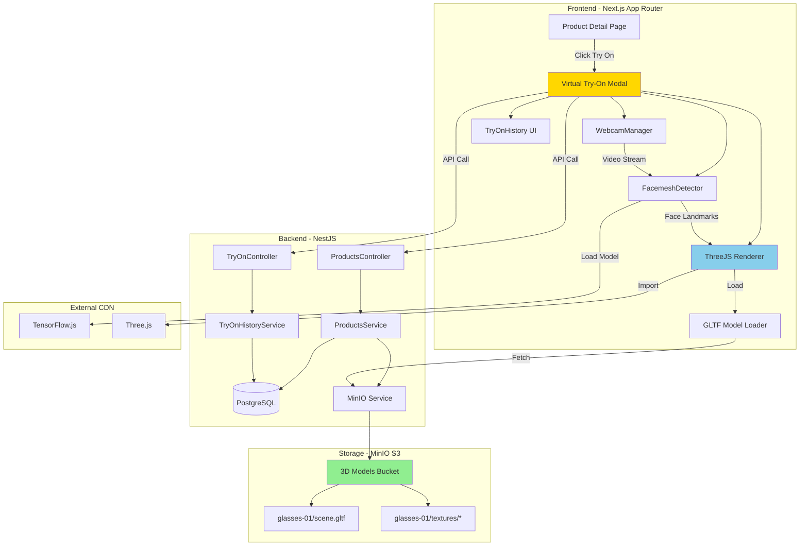

# System Design & Architecture - Virtual Glasses Try-On

## Architecture Overview



### Key Components Responsibilities

1. **Frontend - Virtual Try-On Module**

   - Manage webcam lifecycle (start/stop/permissions)
   - Integrate TensorFlow.js Facemesh for face detection
   - Render 3D glasses using Three.js + WebGL
   - Handle user interactions (model selection, screenshot)
   - Track try-on history

2. **Backend - Products & Try-On Services**

   - Serve product data with 3D model metadata
   - Manage try-on history records
   - Generate pre-signed URLs for MinIO assets
   - Seed data script for 7 glasses models

3. **Storage - MinIO S3**
   - Store GLTF files + textures
   - Serve assets with proper CORS headers
   - Organize by product ID

### Technology Stack Choices

| Component      | Technology                         | Rationale                                              |
| -------------- | ---------------------------------- | ------------------------------------------------------ |
| Face Detection | TensorFlow.js + MediaPipe Facemesh | Industry standard, 486 facial landmarks, browser-based |
| 3D Rendering   | Three.js r116+                     | Reference code proven, WebGL support, GLTF loader      |
| Webcam Access  | WebRTC getUserMedia API            | Native browser API, no extra lib needed                |
| 3D Format      | GLTF 2.0                           | Standard format, PBR materials, small file size        |
| Backend        | NestJS                             | Already in stack, TypeScript, modular                  |
| Database       | PostgreSQL + JSON                  | Already in stack, JSON for flexible 3D config          |
| Storage        | MinIO S3                           | Already setup in Docker, S3-compatible API             |

## Data Models

### 1. Product Entity Extension (Backend)

```typescript
// backend/src/products/entities/product.entity.ts

@Entity("products")
export class Product {
  @PrimaryGeneratedColumn("uuid") // Note: Backend uses CUID, not UUID - TypeORM example shows UUID but actual backend uses @default(cuid())
  id: string;

  @Column({ type: "varchar", length: 255 })
  name: string;

  @Column({ type: "text", nullable: true })
  description?: string;

  @Column({ type: "integer" })
  priceInt: number; // Giá theo cent

  @Column({ type: "varchar", length: 25 }) // CUID format, not UUID
  categoryId: string;

  @Column({ type: "jsonb", nullable: true, default: [] })
  imageUrls: string[];

  // === NEW FIELDS FOR VIRTUAL TRY-ON ===
  @Column({ type: "boolean", default: false })
  hasVirtualTryOn: boolean;

  @Column({ type: "jsonb", nullable: true })
  virtualTryOnConfig?: VirtualTryOnConfig;

  @CreateDateColumn()
  createdAt: Date;

  @UpdateDateColumn()
  updatedAt: Date;
}

// DTO Type
export interface VirtualTryOnConfig {
  modelType: "gltf"; // Support thêm 'glb' sau
  modelPath: string; // MinIO S3 path: "3d-models/glasses-01/scene.gltf"
  texturePaths?: string[]; // Array paths to textures
  position: { x: number; y: number; z: number };
  rotation: { x: number; y: number; z: number };
  scale: number;
  upOffset: number; // Offset để điều chỉnh vị trí lên/xuống
}
```

### 2. TryOnHistory Entity (NEW)

```typescript
// backend/src/try-on-history/entities/try-on-history.entity.ts

@Entity('try_on_history')
export class TryOnHistory {
  @PrimaryGeneratedColumn('uuid') // Note: Backend uses CUID, not UUID - TypeORM example shows UUID but actual backend uses @default(cuid())
  id: string;

  @Column({ type: 'varchar', length: 25 }) // CUID format, not UUID
  userId: string;

  @ManyToOne(() => User)
  @JoinColumn({ name: 'userId' })
  user: User;

  @Column({ type: 'varchar', length: 25 }) // CUID format, not UUID
  productId: string;

  @ManyToOne(() => Product)
  @JoinColumn({ name: 'productId' })
  product: Product;

  @Column({ type: 'timestamp', default: () => 'CURRENT_TIMESTAMP' })
  triedAt: Date;

  @Column({ type: 'integer', default: 1 })
  tryCount: number; // Đếm số lần thử lại cùng sản phẩm

  @CreateDateColumn()
  createdAt: Date;
}

// Index for fast query
@Index(['userId', 'triedAt'])
@Index(['productId'])
```

### 3. Frontend Types (Type-Safe)

```typescript
// frontend/src/types/virtual-try-on.types.ts

import { z } from "zod";

// Zod Schema for runtime validation
export const VirtualTryOnConfigSchema = z.object({
  modelType: z.literal("gltf"),
  modelPath: z.string().url(),
  texturePaths: z.array(z.string().url()).optional(),
  position: z.object({
    x: z.number(),
    y: z.number(),
    z: z.number(),
  }),
  rotation: z.object({
    x: z.number(),
    y: z.number(),
    z: z.number(),
  }),
  scale: z.number().positive(),
  upOffset: z.number(),
});

export type VirtualTryOnConfig = z.infer<typeof VirtualTryOnConfigSchema>;

import { cuidSchema } from '@/types'

// Product with try-on support
export const ProductWithTryOnSchema = z.object({
  id: cuidSchema(), // Backend uses CUID, not UUID
  name: z.string(),
  priceInt: z.number().int(),
  imageUrls: z.array(z.string().url()),
  hasVirtualTryOn: z.boolean(),
  virtualTryOnConfig: VirtualTryOnConfigSchema.nullable(),
});

export type ProductWithTryOn = z.infer<typeof ProductWithTryOnSchema>;

// Try-on history item
export const TryOnHistoryItemSchema = z.object({
  id: cuidSchema(), // Backend uses CUID, not UUID
  productId: cuidSchema(), // Backend uses CUID, not UUID
  triedAt: z.string().datetime(),
  product: z.object({
    id: cuidSchema(), // Backend uses CUID, not UUID
    name: z.string(),
    imageUrls: z.array(z.string().url()),
  }),
});

export type TryOnHistoryItem = z.infer<typeof TryOnHistoryItemSchema>;
```

### 4. Database Migration

```sql
-- backend/migrations/YYYYMMDDHHMMSS-add-virtual-try-on.sql

-- Add columns to products table
ALTER TABLE products
ADD COLUMN has_virtual_try_on BOOLEAN DEFAULT FALSE,
ADD COLUMN virtual_try_on_config JSONB DEFAULT NULL;

-- Create index for filtering
CREATE INDEX idx_products_has_virtual_try_on
ON products(has_virtual_try_on)
WHERE has_virtual_try_on = TRUE;

-- Create try_on_history table
-- Note: Backend uses CUID (VARCHAR), not UUID - SQL example shows UUID but actual backend uses @default(cuid())
CREATE TABLE try_on_history (
  id VARCHAR(25) PRIMARY KEY, -- CUID format, not UUID
  user_id VARCHAR(25) NOT NULL REFERENCES users(id) ON DELETE CASCADE, -- CUID format
  product_id VARCHAR(25) NOT NULL REFERENCES products(id) ON DELETE CASCADE, -- CUID format
  tried_at TIMESTAMP NOT NULL DEFAULT CURRENT_TIMESTAMP,
  try_count INTEGER DEFAULT 1,
  created_at TIMESTAMP DEFAULT CURRENT_TIMESTAMP
);

-- Indexes for performance
CREATE INDEX idx_try_on_history_user_tried
ON try_on_history(user_id, tried_at DESC);

CREATE INDEX idx_try_on_history_product
ON try_on_history(product_id);

-- Unique constraint to prevent duplicate entries in same second
CREATE UNIQUE INDEX idx_try_on_history_unique
ON try_on_history(user_id, product_id, tried_at);
```

## API Design

### REST API Endpoints

#### 1. Get Product with Try-On Config

```typescript
GET /api/products/:id

Response: {
  id: string;
  name: string;
  priceInt: number;
  categoryId: string;
  imageUrls: string[];
  hasVirtualTryOn: boolean;
  virtualTryOnConfig: VirtualTryOnConfig | null;
  ...
}
```

#### 2. Get Products with Try-On Support

```typescript
GET /api/products?hasVirtualTryOn=true&page=1&limit=20

Response: {
  data: ProductWithTryOn[];
  total: number;
  page: number;
  limit: number;
}
```

#### 3. Save Try-On History

```typescript
POST /api/try-on-history
Authorization: Bearer <token>

Request: {
  productId: string;
}

Response: {
  id: string;
  userId: string;
  productId: string;
  triedAt: string;
  tryCount: number;
}

// Logic: Upsert - nếu đã thử trong cùng ngày thì tăng tryCount
```

#### 4. Get User Try-On History

```typescript
GET /api/try-on-history?limit=50&offset=0
Authorization: Bearer <token>

Response: {
  data: TryOnHistoryItem[];
  total: number;
}
```

#### 5. MinIO Pre-Signed URL (Internal)

```typescript
// Internal service method
async getModelUrl(modelPath: string): Promise<string> {
  // Generate pre-signed URL với expiry 1 hour
  return minioClient.presignedGetObject('3d-models', modelPath, 3600);
}
```

### API Service Pattern (Frontend)

```typescript
// frontend/src/services/virtual-try-on.service.ts

class VirtualTryOnApiService extends BaseApiService {
  async getProductForTryOn(productId: string): Promise<ProductWithTryOn> {
    const response = await this.get<ProductWithTryOn>(`/products/${productId}`);
    return ProductWithTryOnSchema.parse(response);
  }

  async saveTryOnHistory(productId: string): Promise<void> {
    await this.post("/try-on-history", { productId });
  }

  async getTryOnHistory(limit = 50): Promise<TryOnHistoryItem[]> {
    const response = await this.get<{ data: TryOnHistoryItem[] }>(
      `/try-on-history?limit=${limit}`,
    );
    return z.array(TryOnHistoryItemSchema).parse(response.data);
  }
}

export const virtualTryOnApi = new VirtualTryOnApiService();
```

## Component Breakdown

### Frontend Components Structure

```
frontend/src/
├── app/
│   └── products/
│       └── [id]/
│           ├── page.tsx                    # Product detail page
│           └── try-on/
│               └── page.tsx                # Try-on page (modal alternative)
│
├── features/
│   └── virtual-try-on/
│       ├── components/
│       │   ├── VirtualTryOnModal.tsx       # Main modal container
│       │   ├── WebcamView.tsx              # Webcam + canvas overlay
│       │   ├── GlassesSelector.tsx         # Horizontal slider
│       │   ├── TryOnControls.tsx           # Capture/flip/exit buttons
│       │   └── TryOnHistory.tsx            # History list component
│       │
│       ├── hooks/
│       │   ├── useWebcam.ts                # Webcam lifecycle management
│       │   ├── useFacemesh.ts              # TensorFlow face detection
│       │   ├── useThreeScene.ts            # Three.js scene setup
│       │   ├── useGlassesRenderer.ts       # Render loop + tracking
│       │   └── useTryOnHistory.ts          # React Query wrapper
│       │
│       ├── lib/
│       │   ├── webcam-manager.ts           # WebRTC wrapper
│       │   ├── facemesh-detector.ts        # TF.js detector class
│       │   ├── three-scene-manager.ts      # Three.js scene + camera
│       │   ├── gltf-loader.ts              # Model loading utility
│       │   └── screenshot-capture.ts       # Canvas to image
│       │
│       ├── services/
│       │   └── virtual-try-on.service.ts   # API client
│       │
│       └── types/
│           └── virtual-try-on.types.ts     # Zod schemas + types
│
└── scripts/
    └── seed-data/
        └── virtual-try-on-seed.ts          # Seed 7 glasses models
```

### Backend Services Structure

```
backend/src/
├── products/
│   ├── products.controller.ts              # Extend với try-on query
│   ├── products.service.ts                 # Add hasVirtualTryOn filter
│   └── entities/
│       └── product.entity.ts               # Add new fields
│
├── try-on-history/                         # NEW MODULE
│   ├── try-on-history.module.ts
│   ├── try-on-history.controller.ts
│   ├── try-on-history.service.ts
│   ├── entities/
│   │   └── try-on-history.entity.ts
│   └── dto/
│       ├── create-try-on-history.dto.ts
│       └── try-on-history-response.dto.ts
│
├── minio/
│   ├── minio.service.ts                    # Extend với GLTF upload
│   └── minio.config.ts
│
└── scripts/
    └── seed-data/
        ├── glasses-models.seed.ts          # Seed products + models
        └── upload-3d-models.ts             # Upload to MinIO
```

## Design Decisions

### Decision 1: Client-Side Face Detection vs Backend Processing

**Choice**: Client-side với TensorFlow.js

**Rationale**:

- ✅ Real-time performance (24+ FPS), không có network latency
- ✅ Privacy-friendly: video stream không gửi lên server
- ✅ Giảm tải backend
- ❌ Trade-off: Tăng bundle size (~2MB cho TF.js model)

**Alternatives Considered**:

- Backend processing: Latency cao (200-500ms), privacy concerns
- Native mobile SDK: Out of scope cho phase 1

---

### Decision 2: Modal vs Dedicated Page

**Choice**: Modal Component (có thể toggle sang dedicated page)

**Rationale**:

- ✅ UX tốt hơn: không rời khỏi product page
- ✅ Giữ context của sản phẩm
- ✅ Có thể có dedicated URL `/products/:id/try-on` cho deep linking

---

### Decision 3: Three.js Scene Management

**Choice**: Hook-based architecture (`useThreeScene`, `useGlassesRenderer`)

**Rationale**:

- ✅ Tách biệt concerns (webcam, detection, rendering)
- ✅ Reusable hooks, dễ test
- ✅ Clean up tự động với React useEffect
- ✅ Type-safe với TypeScript

**Pattern**:

```typescript
function VirtualTryOnModal({ productId }: Props) {
  const { videoRef, isReady } = useWebcam();
  const { landmarks } = useFacemesh(videoRef);
  const { scene, camera, renderer } = useThreeScene();
  const { selectModel } = useGlassesRenderer({ scene, camera, landmarks });

  // ...
}
```

---

### Decision 4: Try-On History Storage

**Choice**: Database với upsert logic (increment tryCount nếu duplicate)

**Rationale**:

- ✅ Persistent across devices
- ✅ Có thể analyze user behavior
- ✅ Support recommendations trong tương lai
- ❌ Requires auth (acceptable trade-off)

**Alternative**: LocalStorage

- ✅ No auth needed
- ❌ Lost on device change
- ❌ No analytics

---

### Decision 5: Model Loading Strategy

**Choice**: Lazy load + caching

**Implementation**:

- Load model khi user click "Try On" button (không preload)
- Cache loaded models trong memory (Three.js scene)
- Pre-signed URLs với expiry 1 hour
- CDN caching headers cho GLTF files

---

### Decision 6: Seed Data Naming Convention

**Choice**: Descriptive product names với prefix "Kính 3D -"

**Examples**:

- "Kính 3D - Sport Glasses B307"
- "Kính 3D - Aviator Sunglasses"
- "Kính 3D - Cartoon Glasses"

**Rationale**:

- ✅ Dễ tìm kiếm trong admin/test
- ✅ Clear distinction từ sản phẩm thật
- ✅ SEO-friendly

## Non-Functional Requirements

### Performance Targets

| Metric             | Target                          | Measurement                  |
| ------------------ | ------------------------------- | ---------------------------- |
| Facemesh load time | < 3s                            | Time to first detection      |
| GLTF model load    | < 2s per model                  | Time to scene.add()          |
| Render FPS         | >= 24 (desktop), >= 20 (mobile) | requestAnimationFrame timing |
| Webcam start       | < 1s                            | getUserMedia resolution      |
| API response time  | < 200ms                         | P95 latency                  |

### Scalability Considerations

- **Concurrent Users**: MinIO S3 có thể serve 1000+ concurrent requests
- **Model Storage**: Mỗi model ~2-5MB, 7 models = ~30MB total
- **Database**: Try-on history có thể grow large → partition by month nếu cần
- **CDN**: Có thể add Cloudflare caching trước MinIO sau này

### Security Requirements

1. **Webcam Access**:

   - HTTPS required (development: localhost exception)
   - Clear permission prompt
   - Indicator khi camera đang bật

2. **API Authentication**:

   - Try-on history endpoints require JWT token
   - Public endpoints: product data, model URLs

3. **MinIO S3**:

   - Pre-signed URLs với expiry
   - CORS whitelist chỉ frontend domain
   - Bucket policy: read-only public cho 3d-models bucket

4. **Input Validation**:
   - Zod schema validation cho mọi API response
   - Product ID validation (CUID format - backend uses CUID, not UUID)

### Reliability/Availability Needs

- **Graceful Degradation**:

  - Nếu TF.js load fail → show error + fallback to image gallery
  - Nếu webcam denied → clear instruction + link to settings
  - Nếu model load fail → retry 3 times, then show error

- **Error Boundaries**:

  - React Error Boundary wrap VirtualTryOnModal
  - Sentry logging cho production errors

- **Browser Compatibility**:
  - Feature detection cho WebRTC, WebGL
  - Polyfill cho Safari < 14 (nếu cần)

---

**Next Steps**:

1. Review design với tech lead
2. Validate data model với DBA
3. Proceed to Planning phase → `feature-virtual-glasses-try-on-planning.md`
