# System Design & Architecture

## Architecture Overview

**What is the high-level system structure?**

```mermaid
graph TD
    User[User Browser] -->|1. Upload Image| Frontend[Frontend - Try-on Page]
    Frontend -->|2. Detect Face| MediaPipe[MediaPipe Face Landmarker]
    MediaPipe -->|3. Face Landmarks| Frontend
    Frontend -->|4. Load GLB Model| MinIO[MinIO S3 Storage]
    Frontend -->|5. Render 3D Overlay| ThreeJS[Three.js Renderer]
    ThreeJS -->|6. Display Result| User

    Frontend -->|7. Get Product List| Backend[Backend API]
    Backend -->|8. Query Products| DB[(PostgreSQL)]

    Frontend -->|9. Save Result Optional| Backend
    Backend -->|10. Store Image| MinIO

    Frontend -->|11. Add to Cart| Backend
    Backend -->|12. Update Cart| DB

    style Frontend fill:#a8dadc
    style MediaPipe fill:#457b9d
    style ThreeJS fill:#457b9d
    style Backend fill:#1d3557
    style MinIO fill:#f1faee
    style DB fill:#f1faee
```



### Key Components:

1. **Frontend (Client-Side Processing)**

   - Next.js page/component
   - MediaPipe Face Landmarker (WASM)
   - Three.js for 3D rendering
   - Canvas API for image overlay

2. **Backend API**

   - GET `/api/glasses/models` - List 3D models
   - GET `/api/glasses/models/:id/download` - Serve GLB files
   - POST `/api/glasses/try-on/save` - Save result (optional)
   - POST `/api/cart/add` - Add to cart

3. **Storage (MinIO S3)**

   - 3D models (GLB files) in `glasses-models/` bucket
   - User uploaded images in `try-on-uploads/` bucket (optional, with TTL)
   - Result images in `try-on-results/` bucket (optional)

4. **Database (PostgreSQL)**
   - Products table (với reference đến 3D model)
   - Try-on results metadata (optional)

### Technology Stack Rationale:

| Technology                    | Reason                                                               |
| ----------------------------- | -------------------------------------------------------------------- |
| **MediaPipe Face Landmarker** | Industry-standard, accurate, client-side processing (no server cost) |
| **Three.js**                  | De-facto 3D rendering library for web, supports GLB/GLTF             |
| **Canvas API**                | Composite 2D image + 3D overlay for final output                     |
| **MinIO S3**                  | Already in use, cost-effective object storage                        |
| **Client-side processing**    | Reduce server load, faster response, better privacy                  |

## Data Models

**What data do we need to manage?**

### Backend Data Models

#### GlassesModel (New Table)

```typescript
interface GlassesModel {
  id: string; // CUID
  name: string; // "Aviator Classic"
  description?: string;
  modelUrl: string; // MinIO S3 URL to GLB file
  thumbnailUrl: string; // Preview image
  fileSize: number; // bytes
  createdAt: Date;
  updatedAt: Date;
}
```

#### Product (Extended)

```typescript
interface Product {
  id: string;
  name: string;
  priceInt: number;
  categoryId: string;
  imageUrls: string[];
  isActive: boolean;

  // NEW FIELDS for glasses
  glassesModelId?: string; // Foreign key to GlassesModel
  glassesModel?: GlassesModel; // Relation

  createdAt: Date;
  updatedAt: Date;
}
```

#### TryOnResult (Optional, for save/share feature)

```typescript
interface TryOnResult {
  id: string; // CUID
  userId?: string; // If user is logged in
  productId: string; // Which glasses
  uploadedImageUrl: string; // Original image
  resultImageUrl: string; // Image with glasses overlay
  shareToken?: string; // For public sharing
  expiresAt: Date; // TTL for cleanup
  createdAt: Date;
}
```

### Frontend Data Models

#### FaceLandmarks

```typescript
interface FaceLandmarks {
  nose: { x: number; y: number }; // Bridge of nose
  leftEye: { x: number; y: number };
  rightEye: { x: number; y: number };
  leftEar: { x: number; y: number };
  rightEar: { x: number; y: number };
  faceWidth: number;
  faceAngle: number; // Rotation in degrees
}
```

#### TryOnState

```typescript
interface TryOnState {
  uploadedImage: File | null;
  imagePreviewUrl: string | null;
  faceLandmarks: FaceLandmarks | null;
  selectedGlassesId: string | null;
  isProcessing: boolean;
  error: string | null;
  resultCanvas: HTMLCanvasElement | null;
}
```

### Data Flow:

1. **User uploads image** → Stored in memory (File object)
2. **MediaPipe detects face** → FaceLandmarks extracted
3. **User selects glasses** → Load GLB from MinIO via backend API
4. **Three.js renders 3D** → Positioned based on FaceLandmarks
5. **Composite on Canvas** → Original image + 3D overlay
6. **User downloads** → Canvas.toBlob() → Download file
7. **User saves (optional)** → POST to backend → Store in MinIO + DB

## API Design

**How do components communicate?**

### Backend API Endpoints

#### 1. List Glasses Models

```typescript
GET /api/glasses/models

Response: {
  data: GlassesModel[];
  total: number;
}
```

#### 2. Download GLB Model

```typescript
GET /api/glasses/models/:id/download

Response: Binary GLB file (Content-Type: model/gltf-binary)
```

#### 3. Save Try-On Result (Optional)

```typescript
POST /api/glasses/try-on/save

Request: {
  productId: string;
  uploadedImage: File; // multipart/form-data
  resultImage: Blob; // Canvas output
  shareToken?: string;
}

Response: {
  id: string;
  shareUrl: string; // If shareable
  expiresAt: string;
}
```

#### 4. Get Shared Try-On (Optional)

```typescript
GET /api/glasses/try-on/share/:token

Response: {
  resultImageUrl: string;
  product: Product;
  createdAt: string;
}
```

#### 5. Add to Cart

```typescript
POST / api / cart / add;

Request: {
  productId: string;
  quantity: number;
}

Response: {
  cartId: string;
  itemCount: number;
}
```

### Authentication/Authorization:

- **Public endpoints:** `/api/glasses/models/*`, `/api/glasses/try-on/share/:token`
- **Optional auth:** `/api/glasses/try-on/save` (can work without login)
- **Required auth:** `/api/cart/add` (if user has account; guest checkout TBD)

## Component Breakdown

**What are the major building blocks?**

### Frontend Components

```
app/
└── (public)/
    └── try-on/
        └── page.tsx                 # Main try-on page

features/
└── try-on/
    ├── components/
    │   ├── ImageUploader.tsx        # Upload & preview
    │   ├── FaceDetector.tsx         # MediaPipe integration
    │   ├── GlassesPicker.tsx        # List of glasses models
    │   ├── TryOnCanvas.tsx           # Three.js + Canvas rendering
    │   ├── ResultActions.tsx         # Download, Save, Add to Cart
    │   └── ErrorDisplay.tsx          # Error messages
    │
    ├── hooks/
    │   ├── useFaceDetection.ts       # MediaPipe logic
    │   ├── useGlassesLoader.ts      # Load GLB models
    │   ├── useTryOnRenderer.ts      # Three.js rendering
    │   └── useTryOnState.ts         # State management
    │
    ├── services/
    │   ├── glasses.service.ts        # API calls
    │   └── image.service.ts         # Image processing utils
    │
    ├── types/
    │   └── try-on.types.ts          # TypeScript definitions
    │
    └── utils/
        ├── face-utils.ts            # Landmark calculations
        └── canvas-utils.ts          # Canvas helpers
```

### Backend Components

```
src/
└── modules/
    └── glasses/
        ├── glasses.controller.ts    # API endpoints
        ├── glasses.service.ts       # Business logic
        ├── glasses.repository.ts    # Database access
        ├── dto/
        │   ├── create-glasses-model.dto.ts
        │   └── save-try-on.dto.ts
        └── entities/
            ├── glasses-model.entity.ts
            └── try-on-result.entity.ts
```

### Third-Party Integrations:

1. **MediaPipe Face Landmarker**

   - Client-side WASM module
   - Loaded from CDN or bundled
   - ~5MB download size

2. **Three.js**

   - GLTFLoader for loading GLB files
   - PerspectiveCamera for 3D projection
   - WebGLRenderer for rendering

3. **MinIO S3**
   - SDK: `minio` (Node.js) or `@aws-sdk/client-s3`
   - Presigned URLs for direct download (avoid proxy)

## Design Decisions

**Why did we choose this approach?**

### Decision 1: Client-Side Face Detection

**Chosen:** MediaPipe Face Landmarker (client-side WASM)

**Alternatives Considered:**

- Server-side OpenCV/dlib
- Cloud APIs (AWS Rekognition, Google Vision)

**Rationale:**

- ✅ No server cost per request
- ✅ Faster (no upload/download latency)
- ✅ Better privacy (images stay on client)
- ✅ MediaPipe is highly accurate and optimized
- ❌ Requires modern browser (Chrome OK)
- ❌ Initial WASM download (~5MB)

### Decision 2: Static Image Only (No Real-Time)

**Chosen:** Upload image, process once

**Alternatives Considered:**

- Real-time webcam with live tracking

**Rationale:**

- ✅ Simpler implementation
- ✅ Better quality control (user picks best photo)
- ✅ Lower resource consumption
- ✅ Phù hợp với constraint (Chrome desktop only)
- ❌ Less interactive/engaging
- ❌ No "wow factor" of real-time AR

### Decision 3: GLB Format for 3D Models

**Chosen:** GLB (binary GLTF)

**Alternatives Considered:**

- OBJ + MTL
- FBX
- USD/USDZ

**Rationale:**

- ✅ Industry standard for web 3D
- ✅ Compact binary format
- ✅ Excellent Three.js support
- ✅ Có sẵn models trong `3dmodel/` folder
- ✅ Includes materials, textures in single file

### Decision 4: Canvas Composite for Output

**Chosen:** Canvas 2D API để overlay 3D render on 2D image

**Alternatives Considered:**

- Pure WebGL texture rendering
- CSS overlay (không downloadable)

**Rationale:**

- ✅ Easy to export (canvas.toBlob())
- ✅ Simple compositing
- ✅ Good quality control
- ❌ Slight quality loss if not careful with resolution

## Non-Functional Requirements

**How should the system perform?**

### Performance Targets:

- **Initial page load:** < 3s (excluding 3D models)
- **Face detection:** < 2s per image
- **3D model load:** < 2s per model (with caching)
- **Render update:** < 500ms when switching glasses
- **Download generation:** < 2s for full resolution image

### Scalability Considerations:

- Client-side processing scales naturally (no server bottleneck)
- MinIO S3 can handle high concurrent downloads
- CDN for 3D models to reduce latency (future optimization)
- Database queries minimal (just product list)

### Security Requirements:

- **Input validation:** Check file type, size before upload
- **XSS prevention:** Sanitize file names, no eval() on user input
- **Rate limiting:** Limit try-on save requests (if implemented)
- **CORS:** Restrict origins for API endpoints
- **Content Security Policy:** Restrict script sources

### Reliability/Availability:

- **Graceful degradation:** Show error if MediaPipe fails to load
- **Offline support:** Cache 3D models in browser (future)
- **Error recovery:** Retry failed 3D model downloads
- **Monitoring:** Track face detection success rate, render errors

### Accessibility:

- Keyboard navigation for glasses picker
- Alt text for all images
- Screen reader support for try-on results
- High contrast mode compatibility (if possible)
