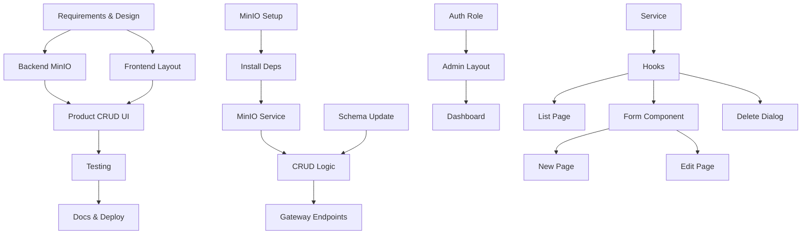

# Project Planning & Task Breakdown - Admin Product Management

## Milestones

**What are the major checkpoints?**

- [x] **M0**: Requirements & Design Complete (2025-11-04)
- [ ] **M1**: Backend MinIO Integration (Day 1-2)
  - MinIO setup with Docker
  - Product-app file upload service
  - Admin API endpoints in Gateway
- [ ] **M2**: Frontend Admin Layout & Auth (Day 3-4)
  - Admin layout with sidebar
  - Route protection for admin
  - Auth store role check
- [ ] **M3**: Product CRUD UI (Day 5-7)
  - Product list with search/filter
  - Create product form
  - Edit product form
  - Delete with confirmation
- [ ] **M4**: Testing & Polish (Day 8-9)
  - Unit tests for services/hooks
  - Integration tests for API flows
  - E2E tests for admin workflows
- [ ] **M5**: Documentation & Deployment (Day 10)
  - Update docs
  - Deployment guide
  - Demo video/screenshots

## Task Breakdown

**What specific work needs to be done?**

### Phase 1: Backend Foundation (MinIO + API)

#### Task 1.1: MinIO Setup & Configuration

**Owner:** Backend  
**Estimated Effort:** 2 hours  
**Dependencies:** Docker installed

**Subtasks:**

- [ ] 1.1.1: Create `docker-compose.minio.yml` với MinIO service
  ```yaml
  version: "3.8"
  services:
    minio:
      image: quay.io/minio/minio:latest
      container_name: minio-storage
      ports:
        - "9000:9000" # API
        - "9001:9001" # Console
      environment:
        MINIO_ROOT_USER: admin
        MINIO_ROOT_PASSWORD: minio123456
      volumes:
        - ./minio-data:/data
      command: server /data --console-address ":9001"
  ```
- [ ] 1.1.2: Start MinIO container: `docker-compose -f docker-compose.minio.yml up -d`
- [ ] 1.1.3: Access console `http://localhost:9001` và verify login
- [ ] 1.1.4: Tạo bucket `products` qua Web Console
- [ ] 1.1.5: Apply public read policy cho bucket `products`:
  ```json
  {
    "Version": "2012-10-17",
    "Statement": [
      {
        "Effect": "Allow",
        "Principal": { "AWS": ["*"] },
        "Action": ["s3:GetObject"],
        "Resource": ["arn:aws:s3:::products/*"]
      }
    ]
  }
  ```
- [ ] 1.1.6: Test upload file manually qua Console
- [ ] 1.1.7: Verify image accessible tại `http://localhost:9000/products/{filename}`

**Acceptance Criteria:**

- MinIO container chạy stable
- Bucket `products` tồn tại và public readable
- Console accessible tại port 9001

---

#### Task 1.2: Install MinIO Dependencies (Backend)

**Owner:** Backend  
**Estimated Effort:** 30 minutes  
**Dependencies:** Task 1.1

**Subtasks:**

- [ ] 1.2.1: Vào `backend-luan-van/` root
- [ ] 1.2.2: Install packages:
  ```bash
  cd apps/product-app
  pnpm add nestjs-minio-client minio
  pnpm add -D @types/multer
  ```
- [ ] 1.2.3: Verify `package.json` có dependencies đúng

---

#### Task 1.3: Create MinIO Service Module (Product-app)

**Owner:** Backend  
**Estimated Effort:** 3 hours  
**Dependencies:** Task 1.2

**Subtasks:**

- [ ] 1.3.1: Tạo `apps/product-app/src/minio/` folder
- [ ] 1.3.2: Create `config.ts`:
  ```typescript
  export const MINIO_CONFIG = {
    endpoint: "localhost",
    port: 9000,
    accessKey: "admin",
    secretKey: "minio123456",
    bucket: "products",
    useSSL: false,
  };
  ```
- [ ] 1.3.3: Create `file.model.ts` với interfaces:
  ```typescript
  export interface BufferedFile {
    fieldname: string;
    originalname: string;
    encoding: string;
    mimetype: string;
    size: number;
    buffer: Buffer;
  }
  export interface UploadedFileResponse {
    url: string;
    filename: string;
  }
  ```
- [ ] 1.3.4: Create `minio.module.ts`:

  ```typescript
  import { Module } from "@nestjs/common";
  import { MinioModule } from "nestjs-minio-client";
  import { MinioService } from "./minio.service";
  import { MINIO_CONFIG } from "./config";

  @Module({
    imports: [
      MinioModule.register({
        endPoint: MINIO_CONFIG.endpoint,
        port: MINIO_CONFIG.port,
        useSSL: MINIO_CONFIG.useSSL,
        accessKey: MINIO_CONFIG.accessKey,
        secretKey: MINIO_CONFIG.secretKey,
      }),
    ],
    providers: [MinioService],
    exports: [MinioService],
  })
  export class MinioClientModule {}
  ```

- [ ] 1.3.5: Create `minio.service.ts` với methods:
  ```typescript
  async upload(file: BufferedFile): Promise<UploadedFileResponse>
  async delete(filename: string): Promise<void>
  ```
- [ ] 1.3.6: Implement upload logic:
  - Validate MIME type (jpeg, png, webp only)
  - Generate unique filename (hash + timestamp + ext)
  - Upload to MinIO với `putObject()`
  - Return public URL
- [ ] 1.3.7: Implement delete logic:
  - Call `removeObject(bucket, filename)`
  - Error handling nếu file not found

**Acceptance Criteria:**

- MinioService injectable vào other modules
- upload() method trả về valid URL
- delete() method xóa file thành công

---

#### Task 1.4: Update Product Entity Schema (Prisma)

**Owner:** Backend  
**Estimated Effort:** 30 minutes  
**Dependencies:** None (can run parallel)

**Subtasks:**

- [ ] 1.4.1: Edit `apps/product-app/prisma/schema.prisma`
- [ ] 1.4.2: Add fields to `Product` model:

  ```prisma
  model Product {
    // ... existing fields
    imageUrl      String?
    imageFilename String?
    isDeleted     Boolean   @default(false)

    @@index([isDeleted])
    @@index([name]) // For search
  }
  ```

- [ ] 1.4.3: Generate Prisma client:
  ```bash
  cd apps/product-app
  pnpm db:gen
  ```
- [ ] 1.4.4: Create migration:
  ```bash
  npx prisma migrate dev --name add_product_image_fields
  ```
- [ ] 1.4.5: Verify migration applied: check `_prisma_migrations` table

**Acceptance Criteria:**

- Migration file created
- Database schema updated
- Prisma client regenerated with new fields

---

#### Task 1.5: Implement Admin Product CRUD (Product-app)

**Owner:** Backend  
**Estimated Effort:** 4 hours  
**Dependencies:** Task 1.3, Task 1.4

**Subtasks:**

- [ ] 1.5.1: Create DTOs in `apps/product-app/src/products/dto/`:

  ```typescript
  // admin-create-product.dto.ts
  export class AdminCreateProductDto {
    @IsNotEmpty() @IsString() name: string;
    @IsNotEmpty() @IsNumber() @Min(0) price: number;
    @IsOptional() @IsString() description?: string;
    @IsOptional() @IsString() categoryId?: string;
  }

  // admin-query-product.dto.ts
  export class AdminQueryProductDto {
    @IsOptional() @IsNumber() @Min(1) page?: number;
    @IsOptional() @IsNumber() @Min(1) limit?: number;
    @IsOptional() @IsString() search?: string;
    @IsOptional() @IsString() categoryId?: string;
  }
  ```

- [ ] 1.5.2: Update `products.service.ts`:

  ```typescript
  // Inject MinioService
  constructor(
    private prisma: PrismaService,
    private minioService: MinioService
  ) {}

  async adminCreate(dto: AdminCreateProductDto, file?: BufferedFile) {
    let imageUrl, imageFilename = null;
    if (file) {
      const uploaded = await this.minioService.upload(file);
      imageUrl = uploaded.url;
      imageFilename = uploaded.filename;
    }
    return this.prisma.product.create({
      data: { ...dto, imageUrl, imageFilename }
    });
  }

  async adminUpdate(id: string, dto, file?) {
    const product = await this.findOne(id);
    if (file && product.imageFilename) {
      await this.minioService.delete(product.imageFilename);
    }
    if (file) {
      const uploaded = await this.minioService.upload(file);
      dto.imageUrl = uploaded.url;
      dto.imageFilename = uploaded.filename;
    }
    return this.prisma.product.update({ where: { id }, data: dto });
  }

  async adminSoftDelete(id: string) {
    return this.prisma.product.update({
      where: { id },
      data: { isDeleted: true }
    });
  }

  async adminList(query: AdminQueryProductDto) {
    // Implement pagination, search, filter
    // Return { data: Product[], meta: { page, limit, total, totalPages } }
  }
  ```

- [ ] 1.5.3: Update `products.controller.ts` (NATS message patterns):

  ```typescript
  @MessagePattern(EVENTS.PRODUCT.ADMIN_LIST)
  async adminList(@Payload() query: AdminQueryProductDto) {
    return this.productsService.adminList(query);
  }

  @MessagePattern(EVENTS.PRODUCT.ADMIN_CREATE)
  async adminCreate(@Payload() payload: { dto: AdminCreateProductDto, file?: any }) {
    return this.productsService.adminCreate(payload.dto, payload.file);
  }

  // Similar for UPDATE, DELETE
  ```

- [ ] 1.5.4: Add events to `libs/shared/events.ts`:
  ```typescript
  PRODUCT: {
    ADMIN_LIST: 'product.admin.list',
    ADMIN_GET: 'product.admin.get',
    ADMIN_CREATE: 'product.admin.create',
    ADMIN_UPDATE: 'product.admin.update',
    ADMIN_DELETE: 'product.admin.delete',
  }
  ```
- [ ] 1.5.5: Import `MinioClientModule` vào `products.module.ts`

**Acceptance Criteria:**

- CRUD methods hoạt động với/không có file upload
- Soft delete set `isDeleted: true`
- Old image deleted khi upload new image
- Search/filter/pagination hoạt động đúng

---

#### Task 1.6: Create Gateway Admin Endpoints

**Owner:** Backend  
**Estimated Effort:** 3 hours  
**Dependencies:** Task 1.5

**Subtasks:**

- [ ] 1.6.1: Create `AdminRoleGuard` trong `apps/gateway/src/guards/`:
  ```typescript
  @Injectable()
  export class AdminRoleGuard implements CanActivate {
    canActivate(context: ExecutionContext): boolean {
      const request = context.switchToHttp().getRequest();
      const user = request.user; // From AuthGuard
      if (!user || user.role !== "ADMIN") {
        throw new ForbiddenException("Admin access required");
      }
      return true;
    }
  }
  ```
- [ ] 1.6.2: Update `apps/gateway/src/products/products.controller.ts`:

  ```typescript
  @Controller("products")
  export class ProductsController {
    constructor(
      @Inject("PRODUCT_SERVICE") private productClient: ClientProxy,
    ) {}

    @Get()
    async list(@Query() query: ProductQueryDto) {
      return firstValueFrom(
        this.productClient
          .send(EVENTS.PRODUCT.ADMIN_LIST, query)
          .pipe(timeout(5000), retry({ count: 1, delay: 1000 })),
      );
    }

    @Get(":id")
    async getOne(@Param("id") id: string) {
      return firstValueFrom(
        this.productClient
          .send(EVENTS.PRODUCT.ADMIN_GET, { id })
          .pipe(timeout(5000), retry({ count: 1, delay: 1000 })),
      );
    }

    @Post()
    @UseInterceptors(FileInterceptor("image"))
    async create(
      @Body() dto: AdminCreateProductDto,
      @UploadedFile() image?: Express.Multer.File,
    ) {
      const payload = {
        dto,
        file: image
          ? {
              buffer: image.buffer.toString("base64"), // Serialize for NATS
              mimetype: image.mimetype,
              originalname: image.originalname,
              size: image.size,
            }
          : null,
      };
      return firstValueFrom(
        this.productClient
          .send(EVENTS.PRODUCT.ADMIN_CREATE, payload)
          .pipe(timeout(10000), retry({ count: 1, delay: 1000 })),
      );
    }

    @Put(":id")
    @UseInterceptors(FileInterceptor("image"))
    async update(
      @Param("id") id: string,
      @Body() dto: AdminUpdateProductDto,
      @UploadedFile() image?: Express.Multer.File,
    ) {
      // Similar to create
    }

    @Delete(":id")
    async delete(@Param("id") id: string) {
      return firstValueFrom(
        this.productClient
          .send(EVENTS.PRODUCT.ADMIN_DELETE, { id })
          .pipe(timeout(5000), retry({ count: 1, delay: 1000 })),
      );
    }
  }
  ```

- [ ] 1.6.3: Register controller trong `products.module.ts` của Gateway
- [ ] 1.6.4: Test với Postman/HTTP files

**Acceptance Criteria:**

- All admin endpoints protected với AuthGuard + AdminRoleGuard
- Non-admin users receive 403 Forbidden
- File upload forwarded correctly qua NATS
- Endpoints trả về correct data structure

---

### Phase 2: Frontend Admin Layout & Authentication

#### Task 2.1: Update Auth Store với Role

**Owner:** Frontend  
**Estimated Effort:** 1 hour  
**Dependencies:** None

**Subtasks:**

- [ ] 2.1.1: Update `stores/auth.store.ts`:

  ```typescript
  interface AuthState {
    accessToken: string | null;
    refreshToken: string | null;
    user: {
      userId: string;
      email: string;
      role: "ADMIN" | "USER"; // Add role
    } | null;

    isAdmin: () => boolean; // Helper method
  }

  // In store implementation:
  isAdmin: () => {
    const state = get();
    return state.user?.role === "ADMIN";
  };
  ```

- [ ] 2.1.2: Update `decodeToken()` để extract role từ JWT
- [ ] 2.1.3: Update login/register flows để lưu role

**Acceptance Criteria:**

- `auth.store` có field `user.role`
- `isAdmin()` method hoạt động đúng
- Role persist qua page refresh (localStorage)

---

#### Task 2.2: Create Admin Layout Component

**Owner:** Frontend  
**Estimated Effort:** 3 hours  
**Dependencies:** Task 2.1

**Subtasks:**

- [ ] 2.2.1: Create `app/admin/layout.tsx`:

  ```typescript
  "use client";
  import { AdminSidebar } from "@/components/layout/AdminSidebar";
  import { useAuthStore } from "@/stores/auth.store";
  import { useRouter } from "next/navigation";
  import { useEffect } from "react";

  export default function AdminLayout({ children }) {
    const isAdmin = useAuthStore((state) => state.isAdmin());
    const router = useRouter();

    useEffect(() => {
      if (!isAdmin) {
        router.push("/");
        toast.error("Bạn không có quyền truy cập trang này");
      }
    }, [isAdmin]);

    if (!isAdmin) return null;

    return (
      <div className="flex h-screen">
        <AdminSidebar />
        <main className="flex-1 overflow-y-auto p-8">{children}</main>
      </div>
    );
  }
  ```

- [ ] 2.2.2: Create `components/layout/AdminSidebar.tsx` với Shadcn:
  ```typescript
  - Logo/Brand
  - Navigation menu:
    - Dashboard (future)
    - Products (active)
    - Categories (future)
    - Orders (future)
    - Users (future)
  - User profile section
  - Logout button
  ```
- [ ] 2.2.3: Style sidebar với Tailwind (dark bg, white text, hover effects)
- [ ] 2.2.4: Add active link highlight
- [ ] 2.2.5: Make sidebar responsive (collapse on mobile with toggle)

**Acceptance Criteria:**

- Admin layout renders với sidebar
- Non-admin users redirected về `/`
- Sidebar navigation hoạt động
- Responsive trên mobile

---

#### Task 2.3: Create Admin Dashboard Placeholder

**Owner:** Frontend  
**Estimated Effort:** 30 minutes  
**Dependencies:** Task 2.2

**Subtasks:**

- [ ] 2.3.1: Create `app/admin/page.tsx`:
  ```typescript
  export default function AdminDashboard() {
    return (
      <div>
        <h1 className="text-3xl font-bold mb-6">Admin Dashboard</h1>
        <div className="grid grid-cols-1 md:grid-cols-3 gap-4">
          <Card>
            <CardHeader>Total Products</CardHeader>
            <CardContent>Coming soon...</CardContent>
          </Card>
          {/* More stats cards */}
        </div>
      </div>
    );
  }
  ```
- [ ] 2.3.2: Add link từ sidebar "Dashboard"

**Acceptance Criteria:**

- Dashboard page accessible tại `/admin`
- Shows placeholder content
- Layout consistent với admin design

---

### Phase 3: Product CRUD UI

#### Task 3.1: Create Admin Product Service

**Owner:** Frontend  
**Estimated Effort:** 2 hours  
**Dependencies:** None (can start after Phase 1)

**Subtasks:**

- [ ] 3.1.1: Create `features/products/services/admin-products.service.ts`:

  ```typescript
  import { apiClient } from "@/lib/api-client";
  import type {
    Product,
    ProductListResponse,
    CreateProductRequest,
    UpdateProductRequest,
    ProductQueryParams,
  } from "@/types";

  const BASE_URL = "/products";

  export const adminProductsApi = {
    async list(params: ProductQueryParams): Promise<ProductListResponse> {
      const response = await apiClient.get(BASE_URL, { params });
      return response.data;
    },

    async getById(id: string): Promise<Product> {
      const response = await apiClient.get(`${BASE_URL}/${id}`);
      return response.data;
    },

    async create(data: CreateProductRequest): Promise<Product> {
      const formData = new FormData();
      formData.append("name", data.name);
      formData.append("price", data.price.toString());
      if (data.description) formData.append("description", data.description);
      if (data.categoryId) formData.append("categoryId", data.categoryId);
      if (data.image) formData.append("image", data.image);

      const response = await apiClient.post(BASE_URL, formData, {
        headers: { "Content-Type": "multipart/form-data" },
      });
      return response.data;
    },

    async update(id: string, data: UpdateProductRequest): Promise<Product> {
      const formData = new FormData();
      if (data.name) formData.append("name", data.name);
      if (data.price) formData.append("price", data.price.toString());
      if (data.description) formData.append("description", data.description);
      if (data.categoryId) formData.append("categoryId", data.categoryId);
      if (data.image) formData.append("image", data.image);

      const response = await apiClient.put(`${BASE_URL}/${id}`, formData, {
        headers: { "Content-Type": "multipart/form-data" },
      });
      return response.data;
    },

    async delete(id: string): Promise<void> {
      await apiClient.delete(`${BASE_URL}/${id}`);
    },
  };
  ```

- [ ] 3.1.2: Export from `features/products/services/index.ts`

**Acceptance Criteria:**

- Service có đầy đủ CRUD methods
- FormData correctly constructed cho file upload
- TypeScript types đúng

---

#### Task 3.2: Create Custom Hooks cho Admin Products

**Owner:** Frontend  
**Estimated Effort:** 2 hours  
**Dependencies:** Task 3.1

**Subtasks:**

- [ ] 3.2.1: Create `features/products/hooks/use-admin-products.ts`:

  ```typescript
  export function useAdminProducts(params: ProductQueryParams) {
    const [data, setData] = useState<ProductListResponse | null>(null);
    const [loading, setLoading] = useState(true);
    const [error, setError] = useState<string | null>(null);

    const fetchProducts = async () => {
      try {
        setLoading(true);
        setError(null);
        const result = await adminProductsApi.list(params);
        setData(result);
      } catch (err) {
        setError(getErrorMessage(err));
      } finally {
        setLoading(false);
      }
    };

    useEffect(() => {
      fetchProducts();
    }, [JSON.stringify(params)]);

    return { data, loading, error, refetch: fetchProducts };
  }
  ```

- [ ] 3.2.2: Create `use-create-product.ts`:

  ```typescript
  export function useCreateProduct() {
    const [loading, setLoading] = useState(false);
    const [error, setError] = useState<string | null>(null);

    const createProduct = async (data: CreateProductRequest) => {
      setLoading(true);
      setError(null);
      try {
        const product = await adminProductsApi.create(data);
        toast.success("Tạo sản phẩm thành công");
        return product;
      } catch (err) {
        const message = getErrorMessage(err);
        setError(message);
        toast.error(message);
        throw err;
      } finally {
        setLoading(false);
      }
    };

    return { createProduct, loading, error };
  }
  ```

- [ ] 3.2.3: Create `use-update-product.ts` (similar to create)
- [ ] 3.2.4: Create `use-delete-product.ts` (similar to create)

**Acceptance Criteria:**

- Hooks handle loading/error states
- Toast notifications on success/error
- Hooks reusable across components

---

#### Task 3.3: Create Product List Page

**Owner:** Frontend  
**Estimated Effort:** 4 hours  
**Dependencies:** Task 3.2

**Subtasks:**

- [ ] 3.3.1: Create `app/admin/products/page.tsx`:

  ```typescript
  "use client";
  import { useAdminProducts } from "@/features/products/hooks";
  import { ProductList } from "@/features/products/components/admin/ProductList";
  import { ProductFilters } from "@/features/products/components/admin/ProductFilters";
  import { Button } from "@/components/ui/button";
  import Link from "next/link";
  import { useState } from "react";

  export default function AdminProductsPage() {
    const [filters, setFilters] = useState({
      page: 1,
      limit: 10,
      search: "",
      categoryId: "",
    });
    const { data, loading, error, refetch } = useAdminProducts(filters);

    return (
      <div>
        <div className="flex justify-between items-center mb-6">
          <h1 className="text-3xl font-bold">Quản Lý Sản Phẩm</h1>
          <Button asChild>
            <Link href="/admin/products/new">
              <Plus className="mr-2 h-4 w-4" /> Thêm Sản Phẩm
            </Link>
          </Button>
        </div>

        <ProductFilters filters={filters} onChange={setFilters} />

        {loading && <div>Loading...</div>}
        {error && <div className="text-red-500">{error}</div>}
        {data && (
          <ProductList
            products={data.data}
            meta={data.meta}
            onPageChange={(page) => setFilters({ ...filters, page })}
            onDelete={refetch}
          />
        )}
      </div>
    );
  }
  ```

- [ ] 3.3.2: Create `ProductFilters` component:
  - Search input với debounce (use-debounce hook)
  - Category dropdown (fetch categories từ API)
  - Clear filters button
- [ ] 3.3.3: Create `ProductList` component:
  - DataTable với columns: Image, Name, Price, Category, Actions
  - Sortable columns
  - Pagination controls
  - Actions dropdown (Edit, Delete)
- [ ] 3.3.4: Handle URL query params (sync filters với URL)

**Acceptance Criteria:**

- Product list displays correctly với images
- Search/filter hoạt động real-time
- Pagination works với page size selector
- URL reflects current filters

---

#### Task 3.4: Create Product Form Component (Reusable)

**Owner:** Frontend  
**Estimated Effort:** 4 hours  
**Dependencies:** Task 3.2

**Subtasks:**

- [ ] 3.4.1: Create Zod schema `features/products/schemas/product-form.schema.ts`:

  ```typescript
  import { z } from "zod";

  export const productFormSchema = z.object({
    name: z.string().min(1, "Tên sản phẩm là bắt buộc"),
    price: z.number().min(0, "Giá phải >= 0"),
    description: z.string().optional(),
    categoryId: z.string().optional(),
    image: z.instanceof(File).optional(),
  });

  export type ProductFormData = z.infer<typeof productFormSchema>;
  ```

- [ ] 3.4.2: Create `features/products/components/admin/ProductForm.tsx`:

  ```typescript
  import { useForm } from "react-hook-form";
  import { zodResolver } from "@hookform/resolvers/zod";
  import {
    Form,
    FormField,
    FormItem,
    FormLabel,
    FormControl,
    FormMessage,
  } from "@/components/ui/form";
  import { Input } from "@/components/ui/input";
  import { Textarea } from "@/components/ui/textarea";
  import { Button } from "@/components/ui/button";
  import { ProductImageUpload } from "./ProductImageUpload";

  interface Props {
    initialData?: Product; // For edit mode
    onSubmit: (data: ProductFormData) => Promise<void>;
    isSubmitting: boolean;
  }

  export function ProductForm({ initialData, onSubmit, isSubmitting }: Props) {
    const form = useForm<ProductFormData>({
      resolver: zodResolver(productFormSchema),
      defaultValues: initialData || {
        name: "",
        price: 0,
        description: "",
        categoryId: "",
      },
    });

    return (
      <Form {...form}>
        <form onSubmit={form.handleSubmit(onSubmit)} className="space-y-6">
          <FormField
            name="name"
            render={({ field }) => (
              <FormItem>
                <FormLabel>Tên sản phẩm *</FormLabel>
                <FormControl>
                  <Input {...field} />
                </FormControl>
                <FormMessage />
              </FormItem>
            )}
          />

          <FormField
            name="price"
            render={({ field }) => (
              <FormItem>
                <FormLabel>Giá (VND) *</FormLabel>
                <FormControl>
                  <Input
                    type="number"
                    {...field}
                    onChange={(e) => field.onChange(Number(e.target.value))}
                  />
                </FormControl>
                <FormMessage />
              </FormItem>
            )}
          />

          <FormField
            name="description"
            render={({ field }) => (
              <FormItem>
                <FormLabel>Mô tả</FormLabel>
                <FormControl>
                  <Textarea {...field} rows={5} />
                </FormControl>
                <FormMessage />
              </FormItem>
            )}
          />

          <FormField
            name="categoryId"
            render={({ field }) => (
              <FormItem>
                <FormLabel>Danh mục</FormLabel>
                <FormControl>
                  <CategorySelect
                    value={field.value}
                    onChange={field.onChange}
                  />
                </FormControl>
                <FormMessage />
              </FormItem>
            )}
          />

          <FormField
            name="image"
            render={({ field }) => (
              <FormItem>
                <FormLabel>Hình ảnh</FormLabel>
                <FormControl>
                  <ProductImageUpload
                    currentImage={initialData?.imageUrl}
                    onChange={field.onChange}
                  />
                </FormControl>
                <FormMessage />
              </FormItem>
            )}
          />

          <Button type="submit" disabled={isSubmitting}>
            {isSubmitting ? "Đang lưu..." : "Lưu sản phẩm"}
          </Button>
        </form>
      </Form>
    );
  }
  ```

- [ ] 3.4.3: Create `ProductImageUpload` component:
  - Drag & drop zone
  - File input fallback
  - Image preview (existing or new)
  - Clear/remove button
  - Validate file type + size client-side
- [ ] 3.4.4: Create `CategorySelect` component (dropdown fetch categories)

**Acceptance Criteria:**

- Form validates với Zod schema
- Image upload có preview
- Form reusable cho create/edit
- Error messages hiển thị rõ ràng

---

#### Task 3.5: Create New Product Page

**Owner:** Frontend  
**Estimated Effort:** 1 hour  
**Dependencies:** Task 3.4

**Subtasks:**

- [ ] 3.5.1: Create `app/admin/products/new/page.tsx`:

  ```typescript
  "use client";
  import { ProductForm } from "@/features/products/components/admin/ProductForm";
  import { useCreateProduct } from "@/features/products/hooks";
  import { useRouter } from "next/navigation";

  export default function NewProductPage() {
    const { createProduct, loading } = useCreateProduct();
    const router = useRouter();

    const handleSubmit = async (data: ProductFormData) => {
      await createProduct(data);
      router.push("/admin/products");
    };

    return (
      <div>
        <h1 className="text-3xl font-bold mb-6">Thêm Sản Phẩm Mới</h1>
        <div className="max-w-2xl">
          <ProductForm onSubmit={handleSubmit} isSubmitting={loading} />
        </div>
      </div>
    );
  }
  ```

**Acceptance Criteria:**

- Page renders form correctly
- Submit creates product và redirect về list
- Error handling works

---

#### Task 3.6: Create Edit Product Page

**Owner:** Frontend  
**Estimated Effort:** 2 hours  
**Dependencies:** Task 3.4

**Subtasks:**

- [ ] 3.6.1: Create `app/admin/products/[id]/edit/page.tsx`:

  ```typescript
  "use client";
  import { useEffect, useState } from "react";
  import { useParams, useRouter } from "next/navigation";
  import { ProductForm } from "@/features/products/components/admin/ProductForm";
  import { useUpdateProduct } from "@/features/products/hooks";
  import { adminProductsApi } from "@/features/products/services";

  export default function EditProductPage() {
    const params = useParams();
    const router = useRouter();
    const [product, setProduct] = useState<Product | null>(null);
    const [loading, setLoading] = useState(true);
    const { updateProduct, loading: updating } = useUpdateProduct();

    useEffect(() => {
      const fetchProduct = async () => {
        try {
          const data = await adminProductsApi.getById(params.id as string);
          setProduct(data);
        } catch (error) {
          toast.error("Không tìm thấy sản phẩm");
          router.push("/admin/products");
        } finally {
          setLoading(false);
        }
      };
      fetchProduct();
    }, [params.id]);

    const handleSubmit = async (data: ProductFormData) => {
      await updateProduct(params.id as string, data);
      router.push("/admin/products");
    };

    if (loading) return <div>Loading...</div>;
    if (!product) return null;

    return (
      <div>
        <h1 className="text-3xl font-bold mb-6">Chỉnh Sửa Sản Phẩm</h1>
        <div className="max-w-2xl">
          <ProductForm
            initialData={product}
            onSubmit={handleSubmit}
            isSubmitting={updating}
          />
        </div>
      </div>
    );
  }
  ```

**Acceptance Criteria:**

- Form pre-filled với existing data
- Update saves changes và redirect
- Image update replaces old image

---

#### Task 3.7: Create Delete Confirmation Dialog

**Owner:** Frontend  
**Estimated Effort:** 1 hour  
**Dependencies:** Task 3.2

**Subtasks:**

- [ ] 3.7.1: Create `features/products/components/admin/DeleteProductDialog.tsx`:

  ```typescript
  import {
    AlertDialog,
    AlertDialogAction,
    AlertDialogCancel,
    AlertDialogContent,
    AlertDialogDescription,
    AlertDialogFooter,
    AlertDialogHeader,
    AlertDialogTitle,
  } from "@/components/ui/alert-dialog";
  import { useDeleteProduct } from "@/features/products/hooks";

  interface Props {
    productId: string;
    productName: string;
    open: boolean;
    onOpenChange: (open: boolean) => void;
    onSuccess: () => void;
  }

  export function DeleteProductDialog({
    productId,
    productName,
    open,
    onOpenChange,
    onSuccess,
  }: Props) {
    const { deleteProduct, loading } = useDeleteProduct();

    const handleDelete = async () => {
      await deleteProduct(productId);
      onOpenChange(false);
      onSuccess();
    };

    return (
      <AlertDialog open={open} onOpenChange={onOpenChange}>
        <AlertDialogContent>
          <AlertDialogHeader>
            <AlertDialogTitle>Xác nhận xóa sản phẩm</AlertDialogTitle>
            <AlertDialogDescription>
              Bạn có chắc muốn xóa sản phẩm <strong>{productName}</strong>?
              <br />
              Hành động này không thể hoàn tác.
            </AlertDialogDescription>
          </AlertDialogHeader>
          <AlertDialogFooter>
            <AlertDialogCancel disabled={loading}>Hủy</AlertDialogCancel>
            <AlertDialogAction onClick={handleDelete} disabled={loading}>
              {loading ? "Đang xóa..." : "Xóa"}
            </AlertDialogAction>
          </AlertDialogFooter>
        </AlertDialogContent>
      </AlertDialog>
    );
  }
  ```

- [ ] 3.7.2: Integrate vào ProductList component (Delete action triggers dialog)

**Acceptance Criteria:**

- Dialog hiển thị khi click Delete
- Confirm xóa product và refresh list
- Cancel closes dialog without action

---

### Phase 4: Testing & Quality Assurance

#### Task 4.1: Unit Tests - Services & Hooks

**Owner:** Frontend  
**Estimated Effort:** 4 hours  
**Dependencies:** Phase 3 complete

**Subtasks:**

- [ ] 4.1.1: Test `admin-products.service.ts`:

  ```typescript
  describe("adminProductsApi", () => {
    it("should list products with params", async () => {
      // Mock apiClient.get
      // Call adminProductsApi.list()
      // Assert correct URL and params
    });

    it("should create product with FormData", async () => {
      // Mock apiClient.post
      // Verify FormData construction
    });

    // Similar for update, delete
  });
  ```

- [ ] 4.1.2: Test hooks (`use-admin-products`, `use-create-product`, etc.):

  ```typescript
  describe("useAdminProducts", () => {
    it("should fetch products on mount", async () => {
      // Mock API
      // Render hook
      // Assert loading states
      // Assert data populated
    });

    it("should handle errors gracefully", async () => {
      // Mock API error
      // Assert error state
    });
  });
  ```

- [ ] 4.1.3: Run tests: `pnpm test -- --coverage`
- [ ] 4.1.4: Target 100% coverage cho services/hooks

**Acceptance Criteria:**

- All services have unit tests
- All hooks have unit tests
- Coverage >= 100% for new code
- No failing tests

---

#### Task 4.2: Integration Tests - Backend API

**Owner:** Backend  
**Estimated Effort:** 3 hours  
**Dependencies:** Phase 1 complete

**Subtasks:**

- [ ] 4.2.1: Create `apps/product-app/test/admin-products.e2e-spec.ts`:

  ```typescript
  describe("Admin Products API (e2e)", () => {
    beforeAll(async () => {
      // Setup test database
      // Start NATS
      // Start MinIO (use testcontainers?)
    });

    it("should create product with image", async () => {
      // Send NATS message with file buffer
      // Assert product created in DB
      // Assert file exists in MinIO
    });

    it("should update product and replace image", async () => {
      // Create product with image A
      // Update with image B
      // Assert image A deleted, image B exists
    });

    it("should soft delete product", async () => {
      // Create product
      // Delete
      // Assert isDeleted = true
      // Assert not in list results
    });
  });
  ```

- [ ] 4.2.2: Run E2E tests: `pnpm test:e2e`

**Acceptance Criteria:**

- E2E tests cover create/update/delete flows
- MinIO integration tested
- All tests pass

---

#### Task 4.3: E2E Tests - Frontend UI

**Owner:** Frontend  
**Estimated Effort:** 4 hours  
**Dependencies:** Phase 3 complete

**Subtasks:**

- [ ] 4.3.1: Create `e2e/admin-product-management.spec.ts`:

  ```typescript
  import { test, expect } from "@playwright/test";

  test.describe("Admin Product Management", () => {
    test.beforeEach(async ({ page }) => {
      // Login as admin
      await page.goto("/admin/products");
    });

    test("should list all products", async ({ page }) => {
      await expect(page.locator("h1")).toContainText("Quản Lý Sản Phẩm");
      await expect(page.locator("table tbody tr")).toHaveCount.greaterThan(0);
    });

    test("should create new product with image", async ({ page }) => {
      await page.click("text=Thêm Sản Phẩm");
      await page.fill('input[name="name"]', "Test Product");
      await page.fill('input[name="price"]', "1000000");
      await page.fill('textarea[name="description"]', "Test description");

      // Upload image
      const fileInput = page.locator('input[type="file"]');
      await fileInput.setInputFiles("test-fixtures/product-image.jpg");

      await page.click('button[type="submit"]');

      // Assert redirected to list
      await expect(page).toHaveURL("/admin/products");
      await expect(page.locator("text=Test Product")).toBeVisible();
    });

    test("should search and filter products", async ({ page }) => {
      await page.fill('input[placeholder*="Tìm kiếm"]', "iPhone");
      await page.waitForTimeout(500); // Debounce

      const rows = page.locator("table tbody tr");
      await expect(rows.first()).toContainText("iPhone");
    });

    test("should edit existing product", async ({ page }) => {
      await page.click('table tbody tr:first-child button:has-text("Edit")');
      await page.fill('input[name="name"]', "Updated Product Name");
      await page.click('button[type="submit"]');

      await expect(page.locator("text=Updated Product Name")).toBeVisible();
    });

    test("should delete product with confirmation", async ({ page }) => {
      const firstProductName = await page
        .locator("table tbody tr:first-child td:nth-child(2)")
        .textContent();

      await page.click('table tbody tr:first-child button:has-text("Delete")');
      await expect(page.locator("text=Xác nhận xóa")).toBeVisible();

      await page.click('button:has-text("Xóa")');
      await expect(page.locator(`text=${firstProductName}`)).not.toBeVisible();
    });
  });
  ```

- [ ] 4.3.2: Add test fixtures (sample images)
- [ ] 4.3.3: Run E2E: `pnpm test:e2e`

**Acceptance Criteria:**

- E2E tests cover full CRUD workflow
- Tests pass consistently
- Screenshots/videos captured on failure

---

#### Task 4.4: Manual Testing Checklist

**Owner:** QA/Developer  
**Estimated Effort:** 2 hours  
**Dependencies:** Phase 3 complete

**Subtasks:**

- [ ] 4.4.1: Test role-based access:
  - Login as regular user → cannot access `/admin/*`
  - Login as admin → can access all admin pages
- [ ] 4.4.2: Test product list:
  - Pagination works (next/prev, page size change)
  - Search finds correct products (case-insensitive)
  - Filter by category works
  - URL syncs với filters
- [ ] 4.4.3: Test create product:
  - Required fields validated
  - Price validation (>= 0)
  - Image upload works (preview displays)
  - Invalid file type rejected
  - Success toast shows
  - Redirect to list after create
- [ ] 4.4.4: Test edit product:
  - Form pre-filled correctly
  - Can update without changing image
  - New image replaces old
  - Changes persist after save
- [ ] 4.4.5: Test delete product:
  - Confirmation dialog shows
  - Cancel closes dialog
  - Confirm deletes product
  - Product removed from list
- [ ] 4.4.6: Test responsive design:
  - Desktop (1920x1080)
  - Tablet (768x1024)
  - Mobile (375x667)
- [ ] 4.4.7: Test browser compatibility:
  - Chrome
  - Firefox
  - Safari (if available)
- [ ] 4.4.8: Test error scenarios:
  - Network error (disconnect WiFi)
  - Backend down (stop services)
  - MinIO down
  - JWT expired

**Acceptance Criteria:**

- All manual test cases pass
- No console errors
- UI responsive on all screen sizes
- Error messages user-friendly

---

### Phase 5: Documentation & Deployment

#### Task 5.1: Update Implementation Doc

**Owner:** Developer  
**Estimated Effort:** 1 hour  
**Dependencies:** Phase 4 complete

**Subtasks:**

- [ ] 5.1.1: Fill out `docs/ai/implementation/feature-admin-product-management.md`
- [ ] 5.1.2: Document setup steps (MinIO Docker command)
- [ ] 5.1.3: Document code structure
- [ ] 5.1.4: Document common issues & solutions

---

#### Task 5.2: Create Deployment Guide

**Owner:** Developer  
**Estimated Effort:** 2 hours  
**Dependencies:** Phase 4 complete

**Subtasks:**

- [ ] 5.2.1: Create `docs/ADMIN-DEPLOYMENT.md`:

  ```markdown
  # Admin Panel Deployment Guide

  ## Prerequisites

  - Docker & Docker Compose
  - Node.js 20+
  - PostgreSQL 16+

  ## MinIO Setup

  1. Start MinIO container:
     `docker-compose -f docker-compose.minio.yml up -d`
  2. Access console: http://localhost:9001
  3. Create bucket `products` with public read policy

  ## Backend Deployment

  1. Install dependencies: `pnpm install`
  2. Run migrations: `pnpm db:migrate:all`
  3. Start services: `pnpm dev:all`

  ## Frontend Deployment

  1. Install dependencies: `pnpm install`
  2. Set env vars:
  ```

  NEXT_PUBLIC_API_URL=http://localhost:3000

  ```
  3. Build: `pnpm build`
  4. Start: `pnpm start`

  ## Production Considerations
  - Use managed MinIO (MinIO Cloud) or AWS S3
  - Configure CDN for images
  - Set proper CORS headers
  - Enable HTTPS
  - Rate limit upload endpoints
  ```

- [ ] 5.2.2: Document environment variables
- [ ] 5.2.3: Document production checklist

---

#### Task 5.3: Create Demo Materials

**Owner:** Developer  
**Estimated Effort:** 2 hours  
**Dependencies:** Phase 4 complete

**Subtasks:**

- [ ] 5.3.1: Record screen demo video (5-10 min):
  - Login as admin
  - Navigate to product list
  - Search/filter demo
  - Create product with image
  - Edit existing product
  - Delete product
- [ ] 5.3.2: Take screenshots cho README:
  - Admin dashboard
  - Product list
  - Create form
  - Edit form
- [ ] 5.3.3: Update main README với admin panel section

---

## Dependencies

**What needs to happen in what order?**



**External Dependencies:**

- MinIO Docker image availability
- Backend product-app API stability
- Shadcn UI components working
- Auth system với role field

**Blocking Dependencies:**

- Cannot start Phase 3 until Phase 1 complete (need working API)
- Cannot start Phase 4 until Phase 3 complete (need UI to test)

## Timeline & Estimates

**When will things be done?**

| Phase                  | Estimated Duration | Target Completion |
| ---------------------- | ------------------ | ----------------- |
| Phase 1: Backend       | 1-2 days           | Day 2             |
| Phase 2: Layout & Auth | 0.5-1 day          | Day 3             |
| Phase 3: CRUD UI       | 2-3 days           | Day 6             |
| Phase 4: Testing       | 1-2 days           | Day 8             |
| Phase 5: Docs          | 0.5-1 day          | Day 9             |
| **Total**              | **7-9 days**       | **Day 9**         |

**Buffer:** 1-2 days cho unexpected issues

**Milestones:**

- Day 2: Backend API ready để frontend integrate
- Day 6: Full CRUD workflow functional
- Day 8: All tests passing
- Day 9: Ready for merge/demo

## Risks & Mitigation

**What could go wrong?**

### Technical Risks

**Risk 1: MinIO Container Issues**

- **Impact:** High - Cannot upload images
- **Probability:** Medium
- **Mitigation:**
  - Test MinIO setup trước khi code
  - Document common issues (port conflicts, permission errors)
  - Fallback: Allow product creation without image (imageUrl = null)

**Risk 2: File Upload Size Limits**

- **Impact:** Medium - Large images fail
- **Probability:** High
- **Mitigation:**
  - Set clear max file size (5MB)
  - Client-side validation trước khi upload
  - Show progress bar cho large files
  - Backend compression/resize nếu cần

**Risk 3: NATS Message Size Limit**

- **Impact:** High - File buffer quá lớn không gửi được qua NATS
- **Probability:** Medium
- **Mitigation:**
  - Encode file as base64 (increase size ~33%)
  - Consider direct HTTP upload endpoint (bypass NATS)
  - Set NATS max_payload config

**Risk 4: Prisma Migration Conflicts**

- **Impact:** Medium - Schema changes conflict với existing data
- **Probability:** Low
- **Mitigation:**
  - Review schema changes carefully
  - Test migrations on dev DB trước
  - Backup production DB

### Resource Risks

**Risk 5: Backend Team Availability**

- **Impact:** High - Frontend blocked nếu API không sẵn
- **Probability:** Low
- **Mitigation:**
  - Clear API contract definition upfront
  - Frontend mock API responses để develop parallel
  - Daily sync meetings

**Risk 6: Shadcn Component Customization**

- **Impact:** Low - UI không đúng design mong muốn
- **Probability:** Medium
- **Mitigation:**
  - Review Shadcn docs trước
  - Prototype critical components trước
  - Allow time cho custom styling

### Timeline Risks

**Risk 7: Scope Creep**

- **Impact:** High - Timeline slips
- **Probability:** High
- **Mitigation:**
  - Stick to MVP scope (basic CRUD only)
  - Document "future features" separately
  - Stakeholder sign-off on scope

**Risk 8: Testing Takes Longer**

- **Impact:** Medium - Delay merge
- **Probability:** Medium
- **Mitigation:**
  - Write tests alongside features (not after)
  - Automate as much as possible
  - 2-day buffer in timeline

## Resources Needed

**What do we need to succeed?**

### Team Members & Roles

- **1 Backend Developer**: MinIO integration, API endpoints (Phase 1)
- **1 Frontend Developer**: Admin UI, forms, hooks (Phase 2-3)
- **1 QA/Tester**: Testing execution (Phase 4)
- **Shared**: Documentation (Phase 5)

### Tools & Services

- **Docker**: MinIO container
- **Postman/Insomnia**: API testing
- **Playwright**: E2E tests
- **Jest**: Unit tests
- **Figma** (optional): UI mockups

### Infrastructure

- **Local Development:**

  - MinIO Docker container
  - PostgreSQL (existing)
  - NATS (existing)
  - Node.js 20+

- **Production (future):**
  - Managed MinIO or AWS S3
  - CDN (CloudFlare/CloudFront)
  - Load balancer

### Documentation/Knowledge

- MinIO official docs: https://min.io/docs
- NestJS file upload: https://docs.nestjs.com/techniques/file-upload
- Next.js 15 file upload: https://nextjs.org/docs/app/building-your-application/routing/route-handlers
- Shadcn UI: https://ui.shadcn.com

---

**Next Steps:**

1. Review plan với team
2. Assign tasks to team members
3. Setup project tracking (GitHub Projects/Jira)
4. Kickoff Phase 1 tasks
5. Daily standups để track progress
