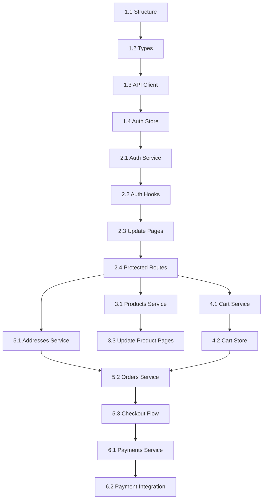

# Project Planning & Task Breakdown - API Integration

## Milestones

- [ ] **M1: Foundation Setup** (Week 1)

  - API client configured
  - Type definitions created
  - Base infrastructure ready

- [ ] **M2: Authentication Complete** (Week 1-2)

  - Login/register working
  - Token refresh implemented
  - Protected routes setup

- [ ] **M3: Core Features** (Week 2-3)

  - Products, cart, orders integrated
  - Main user flows working end-to-end

- [ ] **M4: Payments & Polish** (Week 3-4)
  - Payment integration (COD + SePay)
  - All features tested
  - Ready for production

## Task Breakdown

### Phase 1: Foundation & Infrastructure 🏗️

#### Task 1.1: Project Structure Reorganization

**Priority**: High | **Effort**: 2h | **Status**: ✅ COMPLETED

**Subtasks:**

- [x] Xóa hoặc archive `lib/mock-data.ts`
- [x] Tạo cấu trúc folders mới:
  ```
  types/
  ├── auth.types.ts
  ├── user.types.ts
  ├── address.types.ts
  ├── product.types.ts
  ├── category.types.ts
  ├── cart.types.ts
  ├── order.types.ts
  ├── payment.types.ts
  ├── ar.types.ts
  ├── common.types.ts
  └── index.ts
  ```
- [ ] Refactor `features/` structure:
  - Rename `features/profile` → merge vào `features/users`
  - Rename `features/virtual-tryon` → `features/ar`
  - Tạo `features/categories/` (tách từ products)
  - Tạo `features/payments/` (tách từ orders)

**Acceptance Criteria:**

- Không còn file mock data
- Tất cả types được tổ chức theo domain
- Features structure match với backend services

---

#### Task 1.2: Type Definitions

**Priority**: High | **Effort**: 4h | **Status**: Not Started

**Subtasks:**

- [ ] Copy và adapt types từ backend `@shared/types`:

  - `auth.types.ts` ← `auth.types.ts`
  - `user.types.ts` ← `user.types.ts`
  - `address.types.ts` ← `address.types.ts`
  - `product.types.ts` ← `product.types.ts`
  - `category.types.ts` ← từ `product.types.ts`
  - `cart.types.ts` ← `cart.types.ts`
  - `order.types.ts` ← `order.types.ts`
  - `payment.types.ts` ← `payment.types.ts`
  - `ar.types.ts` ← `ar.types.ts`

- [ ] Tạo `common.types.ts`:

  ```typescript
  export interface PaginatedResponse<T> {
    items: T[];
    total: number;
    page: number;
    pageSize: number;
    totalPages?: number;
  }

  export interface ApiError {
    statusCode: number;
    message: string;
    error?: string;
    timestamp?: string;
  }
  ```

- [ ] Export tất cả từ `types/index.ts`

**Acceptance Criteria:**

- Tất cả types match 100% với backend DTOs
- Có JSDoc comments cho các types phức tạp
- TypeScript compile không có errors

---

#### Task 1.3: API Client Setup

**Priority**: High | **Effort**: 3h | **Status**: Not Started

**Subtasks:**

- [ ] Install dependencies:

  ```bash
  pnpm add axios
  pnpm add -D @types/axios
  ```

- [ ] Tạo `lib/api-client.ts` với:

  - Base axios instance
  - Request interceptor (add auth header)
  - Response interceptor (handle 401, retry)
  - Error transformer

- [ ] Tạo `lib/api-config.ts`:

  ```typescript
  export const API_CONFIG = {
    BASE_URL: process.env.NEXT_PUBLIC_API_URL || "http://localhost:3000",
    TIMEOUT: 10000,
    RETRY_COUNT: 3,
    RETRY_DELAY: 1000,
  };
  ```

- [ ] Setup `.env.local`:
  ```
  NEXT_PUBLIC_API_URL=http://localhost:3000
  ```

**Acceptance Criteria:**

- API client có thể make requests
- Interceptors hoạt động đúng
- Error handling unified

---

#### Task 1.4: Auth Store Setup

**Priority**: High | **Effort**: 2h | **Status**: Not Started

**Subtasks:**

- [ ] Cập nhật `stores/auth.store.ts`:

  - Add `accessToken` và `refreshToken` state
  - Add `setTokens()` và `clearAuth()` methods
  - Setup persistence với `zustand/middleware`
  - Add helper methods: `getAccessToken()`, `getRefreshToken()`

- [ ] Tạo `lib/auth-utils.ts`:
  - `decodeToken(token: string): TokenPayload`
  - `isTokenExpired(token: string): boolean`
  - `getTokenExpiryTime(token: string): number`

**Acceptance Criteria:**

- Tokens được lưu và restore đúng
- Token decode hoạt động
- Zustand devtools có thể inspect state

---

### Phase 2: Authentication 🔐

#### Task 2.1: Auth Service

**Priority**: High | **Effort**: 3h | **Status**: Not Started

**Subtasks:**

- [ ] Tạo `services/auth/auth.service.ts`:

  ```typescript
  export const authService = {
    login(data: LoginRequest): Promise<AuthResponse>
    register(data: RegisterRequest): Promise<AuthResponse>
    refresh(refreshToken: string): Promise<AuthResponse>
    verify(token: string): Promise<VerifyResponse>
    getCurrentUser(): Promise<UserResponse>
  }
  ```

- [ ] Handle token refresh logic trong interceptor
- [ ] Add error handling cho từng method

**Acceptance Criteria:**

- Tất cả auth endpoints có thể gọi được
- Token refresh tự động khi expired
- Errors được handle gracefully

---

#### Task 2.2: Auth Hooks

**Priority**: High | **Effort**: 4h | **Status**: Not Started

**Subtasks:**

- [ ] Tạo `features/auth/hooks/use-auth.ts`:

  ```typescript
  export function useAuth() {
    const login = async (data: LoginRequest) => {...}
    const register = async (data: RegisterRequest) => {...}
    const logout = () => {...}
    return { login, register, logout, loading, error }
  }
  ```

- [ ] Tạo `features/auth/hooks/use-current-user.ts`:
  ```typescript
  export function useCurrentUser() {
    // Fetch current user data
    // Cache trong memory
    return { user, loading, error, refetch };
  }
  ```

**Acceptance Criteria:**

- Hooks dễ sử dụng trong components
- Loading và error states rõ ràng
- User data được cache

---

#### Task 2.3: Update Login/Register Pages

**Priority**: High | **Effort**: 2h | **Status**: Not Started

**Subtasks:**

- [ ] Cập nhật login form để dùng `useAuth()`
- [ ] Cập nhật register form để dùng `useAuth()`
- [ ] Add loading indicators
- [ ] Add error messages display
- [ ] Redirect sau khi login thành công

**Acceptance Criteria:**

- User có thể login/register
- Errors hiển thị rõ ràng
- Redirect đúng sau auth

---

#### Task 2.4: Protected Routes

**Priority**: High | **Effort**: 2h | **Status**: Not Started

**Subtasks:**

- [ ] Tạo `components/auth/protected-route.tsx`
- [ ] Wrap protected pages với `ProtectedRoute`
- [ ] Redirect to login nếu chưa auth
- [ ] Check token validity

**Acceptance Criteria:**

- Protected routes không access được khi chưa login
- Redirect về login page
- User quay lại intended page sau login

---

### Phase 3: Products & Categories 🛍️

#### Task 3.1: Products Service & Hooks

**Priority**: High | **Effort**: 4h | **Status**: Not Started

**Subtasks:**

- [ ] Tạo `services/products/products.service.ts`:

  - `getProducts(query: ProductListQuery)` - list với pagination
  - `getProductById(id: string)` - single product
  - `getProductBySlug(slug: string)` - by slug
  - `searchProducts(query: string)` - search

- [ ] Tạo `features/products/hooks/use-products.ts`:

  - State management cho list
  - Pagination support
  - Filter và search

- [ ] Tạo `features/products/hooks/use-product.ts`:
  - Single product fetch
  - Loading state

**Acceptance Criteria:**

- Products list hiển thị từ API
- Pagination hoạt động
- Search và filter hoạt động
- Product detail page load từ API

---

#### Task 3.2: Categories Service & Hooks

**Priority**: Medium | **Effort**: 3h | **Status**: Not Started

**Subtasks:**

- [ ] Tạo `services/categories/categories.service.ts`
- [ ] Tạo `features/categories/hooks/use-categories.ts`
- [ ] Tạo `features/categories/components/category-filter.tsx`

**Acceptance Criteria:**

- Categories list từ API
- Category filter hoạt động
- Nested categories support (nếu có)

---

#### Task 3.3: Update Product Pages

**Priority**: High | **Effort**: 3h | **Status**: Not Started

**Subtasks:**

- [ ] Update `/products/page.tsx` - dùng `useProducts()`
- [ ] Update `/products/[id]/page.tsx` - dùng `useProduct()`
- [ ] Update product cards để hiển thị real data
- [ ] Format price từ cents sang VND

**Acceptance Criteria:**

- Products page load real data
- Product detail page load real data
- Images hiển thị đúng
- Price format đúng

---

### Phase 4: Cart Integration 🛒

#### Task 4.1: Cart Service

**Priority**: High | **Effort**: 4h | **Status**: Not Started

**Subtasks:**

- [ ] Tạo `services/cart/cart.service.ts`:

  - `getCart(userId: string)` - fetch cart
  - `addItem(data: CartAddItemDto)` - add to cart
  - `updateItem(data: CartUpdateItemDto)` - update quantity
  - `removeItem(data: CartRemoveItemDto)` - remove item

- [ ] Handle stock validation errors

**Acceptance Criteria:**

- Cart operations gọi API
- Stock validation hoạt động
- Errors được handle

---

#### Task 4.2: Cart Store Migration

**Priority**: High | **Effort**: 3h | **Status**: Not Started

**Subtasks:**

- [ ] Update `stores/cart.store.ts`:

  - Sync với server sau mỗi operation
  - Optimistic updates
  - Rollback on error

- [ ] Handle guest cart:
  - Store trong localStorage nếu chưa login
  - Merge với user cart khi login

**Acceptance Criteria:**

- Cart sync với server
- Guest cart hoạt động
- Merge cart on login

---

#### Task 4.3: Update Cart Components

**Priority**: High | **Effort**: 2h | **Status**: Not Started

**Subtasks:**

- [ ] Update cart components để dùng new store
- [ ] Add loading states
- [ ] Handle errors (stock out, etc.)

**Acceptance Criteria:**

- Cart UI hoạt động với real API
- Loading states smooth
- Errors hiển thị rõ ràng

---

### Phase 5: Orders & Checkout 📦

#### Task 5.1: Addresses Service & Hooks

**Priority**: High | **Effort**: 3h | **Status**: Not Started

**Subtasks:**

- [ ] Tạo `services/addresses/addresses.service.ts`
- [ ] Tạo `features/addresses/hooks/use-addresses.ts`
- [ ] Update address components

**Acceptance Criteria:**

- Address CRUD hoạt động
- Set default address hoạt động
- Address picker trong checkout

---

#### Task 5.2: Orders Service & Hooks

**Priority**: High | **Effort**: 4h | **Status**: Not Started

**Subtasks:**

- [ ] Tạo `services/orders/orders.service.ts`:

  - `createOrder(data: OrderCreateDto)` - create order
  - `getOrders(userId: string, query)` - list orders
  - `getOrderById(id: string)` - single order
  - `cancelOrder(id: string)` - cancel order

- [ ] Tạo `features/orders/hooks/use-orders.ts`
- [ ] Tạo `features/orders/hooks/use-create-order.ts`

**Acceptance Criteria:**

- Order creation từ cart
- Order list hiển thị
- Order detail page
- Cancel order hoạt động

---

#### Task 5.3: Checkout Flow

**Priority**: High | **Effort**: 4h | **Status**: Not Started

**Subtasks:**

- [ ] Update `/cart/checkout/page.tsx`:

  - Select address
  - Review cart
  - Select payment method
  - Create order

- [ ] Add validation
- [ ] Handle errors

**Acceptance Criteria:**

- Checkout flow end-to-end
- Address selection
- Order summary
- Error handling

---

### Phase 6: Payments 💳

#### Task 6.1: Payments Service

**Priority**: High | **Effort**: 4h | **Status**: Not Started

**Subtasks:**

- [ ] Tạo `services/payments/payments.service.ts`:
  - `processPayment(data: PaymentProcessDto)` - process COD/SePay
  - `verifyPayment(data: PaymentVerifyDto)` - verify payment
  - `confirmCOD(orderId: string)` - confirm COD (admin)
  - `getPaymentByOrder(orderId: string)` - get payment

**Acceptance Criteria:**

- COD payment working
- SePay QR code generated
- Payment status tracking

---

#### Task 6.2: Payment Integration

**Priority**: High | **Effort**: 5h | **Status**: Not Started

**Subtasks:**

- [ ] Tạo payment method selector
- [ ] COD flow: Create payment → complete order
- [ ] SePay flow:

  - Generate QR code
  - Display QR code
  - Poll payment status hoặc webhook callback
  - Complete order khi paid

- [ ] Handle payment errors

**Acceptance Criteria:**

- COD payment complete
- SePay QR code displayed
- Payment verification
- Order status updated

---

#### Task 6.3: Success & Payment Pages

**Priority**: Medium | **Effort**: 2h | **Status**: Not Started

**Subtasks:**

- [ ] Update `/cart/checkout/success/page.tsx`
- [ ] Add payment status check
- [ ] Display order summary

**Acceptance Criteria:**

- Success page shows order details
- Payment status displayed
- Link to order tracking

---

### Phase 7: Additional Features ✨

#### Task 7.1: User Profile

**Priority**: Medium | **Effort**: 3h | **Status**: Not Started

**Subtasks:**

- [ ] Tạo `services/users/users.service.ts`
- [ ] Update profile page với real API
- [ ] Handle profile update

---

#### Task 7.2: AR Integration

**Priority**: Low | **Effort**: 3h | **Status**: Not Started

**Subtasks:**

- [ ] Tạo `services/ar/ar.service.ts`
- [ ] Tạo `features/ar/hooks/use-ar-snapshots.ts`
- [ ] Update AR components

**Note**: AR snapshot upload cần clarify storage solution (S3/Cloudinary?)

---

#### Task 7.3: Admin Features (Optional)

**Priority**: Low | **Effort**: 8h | **Status**: Not Started

**Subtasks:**

- [ ] Admin product CRUD
- [ ] Admin category CRUD
- [ ] Admin order management
- [ ] Admin user management

**Note**: Chỉ implement nếu cần admin panel

---

### Phase 8: Testing & Documentation 🧪

#### Task 8.1: Unit Tests

**Priority**: Medium | **Effort**: 6h | **Status**: Not Started

**Subtasks:**

- [ ] Test services (mock axios)
- [ ] Test hooks (React Testing Library)
- [ ] Test utils (formatPrice, etc.)
- [ ] Achieve >80% coverage

---

#### Task 8.2: Integration Tests

**Priority**: Medium | **Effort**: 4h | **Status**: Not Started

**Subtasks:**

- [ ] Test auth flow (login → protected route)
- [ ] Test checkout flow (cart → order → payment)
- [ ] Test error scenarios

---

#### Task 8.3: Documentation

**Priority**: Medium | **Effort**: 3h | **Status**: Not Started

**Subtasks:**

- [ ] Update README với API setup
- [ ] Document environment variables
- [ ] Document common errors và solutions
- [ ] API service documentation

---

## Dependencies

### External Dependencies

- ✅ Backend API Gateway running (`http://localhost:3000`)
- ✅ Backend services healthy
- ✅ Database migrations applied
- ⚠️ SePay account và webhook config (cần setup)
- ⚠️ Image CDN config (nếu dùng)

### Task Dependencies



### Blockers

- ❌ **Backend not running**: Cannot test API calls
- ❌ **SePay not configured**: Cannot test SePay payments
- ❌ **Image upload**: Cần clarify storage solution

---

## Timeline & Estimates

### Week 1: Foundation & Auth

- Day 1-2: Tasks 1.1 → 1.4 (Foundation) - **11h**
- Day 3-4: Tasks 2.1 → 2.4 (Authentication) - **11h**
- Day 5: Buffer và testing

**Deliverable**: Login/register working, protected routes

---

### Week 2: Products & Cart

- Day 1-2: Tasks 3.1 → 3.3 (Products) - **10h**
- Day 3-4: Tasks 4.1 → 4.3 (Cart) - **9h**
- Day 5: Buffer và testing

**Deliverable**: Products và cart fully integrated

---

### Week 3: Orders & Checkout

- Day 1-2: Tasks 5.1 → 5.3 (Orders) - **11h**
- Day 3-4: Tasks 6.1 → 6.2 (Payments) - **9h**
- Day 5: Task 6.3 và testing - **2h**

**Deliverable**: Full checkout flow working

---

### Week 4: Polish & Testing

- Day 1-2: Tasks 7.1 → 7.2 (Additional features) - **6h**
- Day 3-4: Tasks 8.1 → 8.2 (Testing) - **10h**
- Day 5: Task 8.3 (Documentation) - **3h**

**Deliverable**: Production-ready, tested, documented

---

## Risks & Mitigation

### Technical Risks

| Risk                          | Likelihood | Impact | Mitigation                           |
| ----------------------------- | ---------- | ------ | ------------------------------------ |
| Backend API changes           | Medium     | High   | Lock backend version, API versioning |
| Token refresh race conditions | Medium     | Medium | Implement request queue              |
| SePay webhook unreliable      | Medium     | High   | Implement polling fallback           |
| Network errors                | High       | Medium | Retry logic, offline support         |
| Type mismatches               | Low        | Medium | Regular sync với backend types       |

### Timeline Risks

| Risk                      | Likelihood | Impact | Mitigation                         |
| ------------------------- | ---------- | ------ | ---------------------------------- |
| Scope creep               | Medium     | High   | Stick to MVP, defer admin features |
| Blocker dependencies      | Low        | High   | Early validation của external deps |
| Underestimated complexity | Medium     | Medium | 20% buffer time                    |

### Mitigation Strategies

1. **Early Backend Validation**

   - Test tất cả API endpoints với Postman/Thunder Client
   - Document API quirks và edge cases

2. **Incremental Development**

   - Implement và test từng domain một
   - Không move sang domain mới khi domain hiện tại chưa stable

3. **Continuous Testing**

   - Test mỗi feature sau khi implement
   - Integration tests cho critical flows

4. **Regular Sync**
   - Daily sync types với backend nếu có updates
   - Weekly review với backend team

---

## Resources Needed

### Team & Roles

- **Frontend Developer**: Implementation (you)
- **Backend Developer**: API support và clarification
- **QA**: Testing assistance (optional)

### Tools & Services

- **Development**:

  - VS Code với TypeScript ESLint
  - Thunder Client hoặc Postman
  - React DevTools
  - Zustand DevTools

- **Testing**:

  - Vitest (unit tests)
  - React Testing Library
  - Playwright or Cypress (E2E)

- **Monitoring** (Production):
  - Sentry (error tracking)
  - Vercel Analytics
  - LogRocket (session replay)

### Infrastructure

- **Development**:

  - Backend running locally (`:3000`)
  - PostgreSQL databases
  - NATS server

- **Production** (Future):
  - API Gateway URL
  - CDN cho images
  - SSL certificates

### Documentation Needed

- ✅ API documentation (provided)
- ⚠️ SePay integration guide
- ⚠️ Deployment guide
- ⚠️ Environment setup guide

---

## Success Metrics

### Code Quality

- TypeScript strict mode enabled
- Zero `any` types trong production code
- > 80% test coverage for critical paths
- ESLint với no errors

### User Experience

- Loading states cho tất cả async operations
- Error messages rõ ràng và actionable
- Smooth transitions, no jarring UX
- Mobile responsive

### Performance

- Lighthouse score >90
- First Contentful Paint <1.5s
- Time to Interactive <3s
- Bundle size reasonable (<500KB)

---

## Next Steps

1. ✅ Review requirements doc
2. ✅ Review design doc
3. ✅ Review planning doc ← **YOU ARE HERE**
4. ⏭️ Run `/execute-plan` to start implementation
5. ⏭️ Regular `/code-review` after major features

**Ready to start?** Run `/execute-plan` khi bạn sẵn sàng implement!
